#  welcome to the first BPL project durung the couuse of the devops projects, so lets get started withiout any delay.

# web stack implementation(lamp stack) in AWS; .
AS A DEVOPS engeneer most of what we do revolves arround software,website,application ,etc, and there are different stalk of technology that makes different solution possible, these stack of technology are regarded as web stack eg; `LAMP, LEMP, MEAN AND MERN`stack, as we proceed you nare required to gain understanding about all these technology stack and their implementation. but before we proceed lets have an understanding of what technology stack is all about

# what is technology stack?, `a technology stalk is a set of frame work used to develop software product, thses set of frame work and tools are very specifically chosen to work together in creating a well functioning software` there are acronynms for individual technology used together for specific technology product, some examples are as follows;
1. LAMP `LINUX APACHE, MYSQL AND PHP, PYTHORN OR PERL`
2. LEMP `LINUX NGINX, MYSQL , PHP, PYTHON OR PERL`
3. MERN `MONGODB, EXPRESSJS, REACTJS ,NODEJS`
4. MEAN `MONGODB, EXPRESSJS, ANGULARJS, NODEJS`
NOTE: most of the things you will be doing  in the early days may not mean a lot to you, sometimes it may seem that you are just copying and pasting, that is absolutely fine. we want some concept to beging to register in your sub-concious mind, and without you realising it you are building up skills, although there are certain traps that will allow you to trouble shoot along the way, so watch out for them in all your project inplementation.

# `after successful compleation of PBL PROJECT 1 to 4, YOU WILL BE ABLE TO ACHIEVE THE FOLLOWING`
1. become very confident in linux terminal
2. deepen your understanding on webstack, and familiarity between the different web technology stack such as;`lamp, lemp,mern, and mean, stack`.
3. solid linux administration skill in storage management,NFS, troubleshooting and basic networking.
4. basic knowledge of AWS platform and component, used to host a website of various web stack.

Being able to work with linux requires the ability to work outside your own present knowledge, it means that in real world you will be facesd with task that you have never worked on before, but with GOOGLE SEARCH, and its results , you can achieve a lot, thanks to GOOGLE, its one of the essential skill you will need to develop- constructing a correct search quary for GOOGLE to process and having the ability to come throuh resources that interpretes to a potential solution for you is a great skill to have as well.

# SIDE SELF STUDY;
1. conduct a google serch on what software development life cycle is, and document your findings a a google word file.
2. conduct another google serch, understand what LAMP stack means,
3. read about `chmod`and `chown` command in linux and understand how access and ownership of file and directory works.
4. learn what `UDP`and `TCP` terms means, and how they are different, list down port most commonly used in web`(http,https,ssh,telnet,ftp,sftp,)`
5. get yourself familiarice with basic text editin in VI(VIM) editor

# preparing prerequisite;

in order to complete this project you will need an AWS account and ubuntu server OS, `NB:`AWS is the biggest cloud service provider, and it offers a free tier account that we are goin to leverage for our project and can provide us with free virtual server called `EC2(elastic cloud computing)` for our needs.

After you have created your AWS account and created an intance`EC2`, these are very important things you must take note of

1. save your private key`(.pem file)` secure and do not share with any one!, if you loose it you will not be a bale to connect to your server ever again.
2. both `putty`, and `SSH` use the `SSH PROTOCOL` to establish connectivity between computers, it is most secure protocol cause it uses crypto algorithem to encrypt the data the data that is transmitted- it uses TCP port 22 , which is open for all newly created instance in AWS by defalt
3. anywhere you see these anchor taggs <>, going faward, it means you will need to replace the contents in there with values specific to your situation
`N;B ( a private key was downloaded from AWS while provisioning the server, it is a PEM file format, you can open it and see a glimps of what a PEM file format looks like.)`, now we are going to use that `PEM` key to connect to our `EC2 ` instance via `SSH`

# commands
1. connect to instance by first  running `cd downloads`

, as you can see the terminal is in the downloads repo

2. connect to an instance by running your AWS instance, go to actions ,click on `ssh ` terminal, copy address and paste on the windows terminal to connect to your AWS instance.
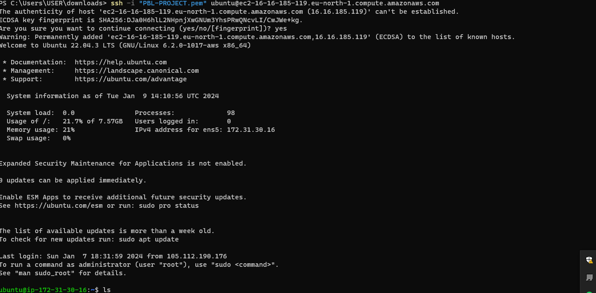

# INSTALLING APACHE AND UPDATING THE FIRE WALL
 installing apache and udating fire wall

 what exactly is apache?, apache HTTP server is the most widely used server software, developed and maintained by apache software foundation, apache is an open source software available for free. it runs on 67% of all web server in the world. it is fast reliable and secure, it can be highly customised to meet the need of many different enviroment by using extension and modoules. most wordpress hosting provider use apache as their web server soft ware. however websites and other application can run on web server software as well, NGINX, Microsoft IIS etc.

 inatall APACHE using ubuntu package manager `apt`.
 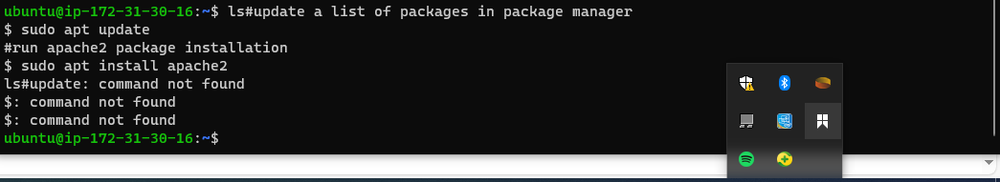
 the responce in the terminal shows that apache is yet to be istalled.

 to verify that apache2 is running as a service in our OS, use the following command
 `$ sudo systemctl status apache2`, to do this,
 1. run `sudo apt update`
 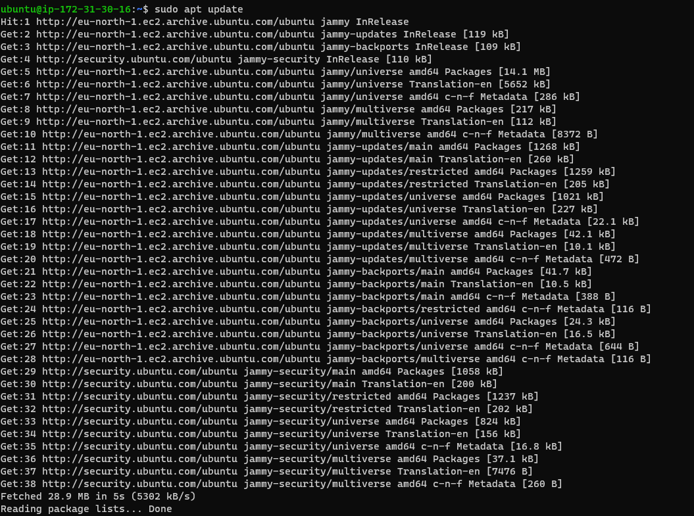

 2. run`apache2 package installation`
 
 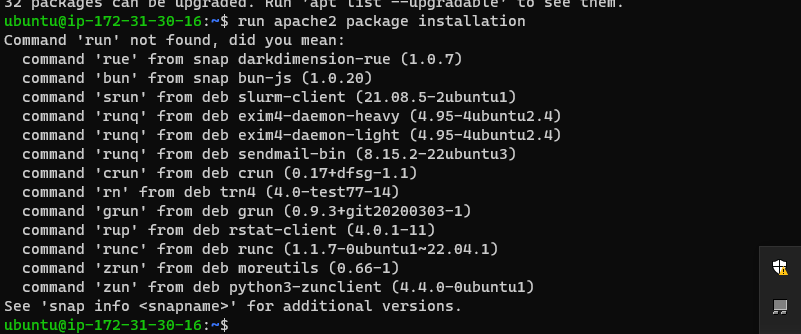

 3. run`sudo apt install apache2`
 
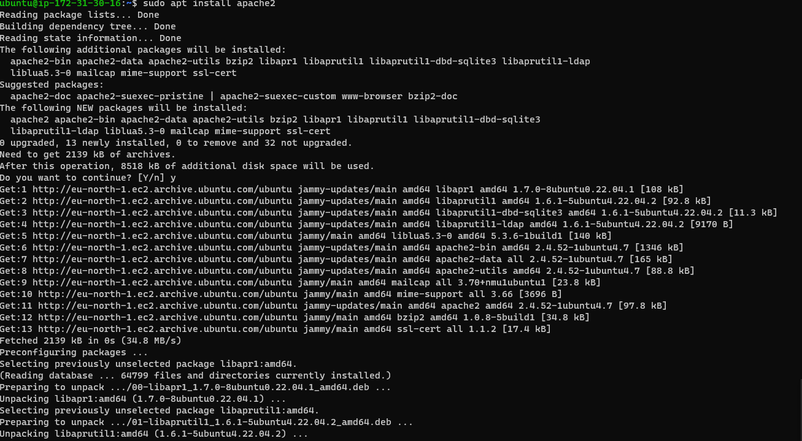

now you can run the `$ sudo systemctl status apache2` to ensure that all installation is perfect
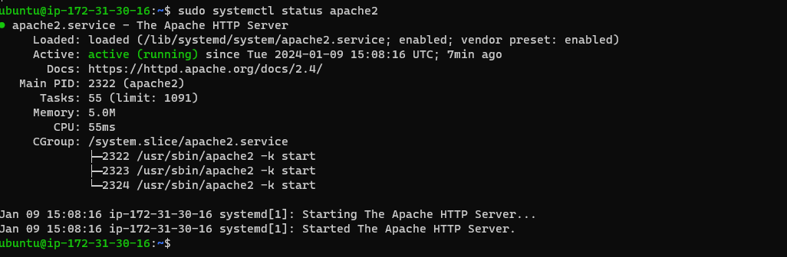

NB; If it is green and running then i did everything correctly,- and i have just lunch my first web server in the cloud,!!!!!!!

Before we can recieve any trafic by our web server we need to open TCP port 80, which is the defalt port tat web browsers uses to access web page on the internet.

As we know , we have TCP port 22 open by defalf on our EC2 machine, to access it via SSH, we need to add a rule to EC2 configuration to open inbound connection through port 80:;

our service is running and we can access it locally from the internet(source0.0.0.0/0 means from any IP address)

firstly let us try to check how we can acces it from pour ubuntu shell, run `$ curl http://localhost:80
or
~$ curl http://localhost:80
or
$ curl http://127.0.0.1:80~

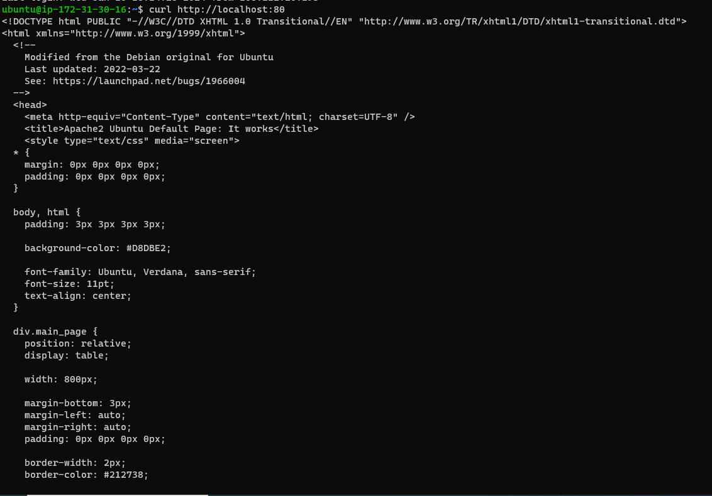
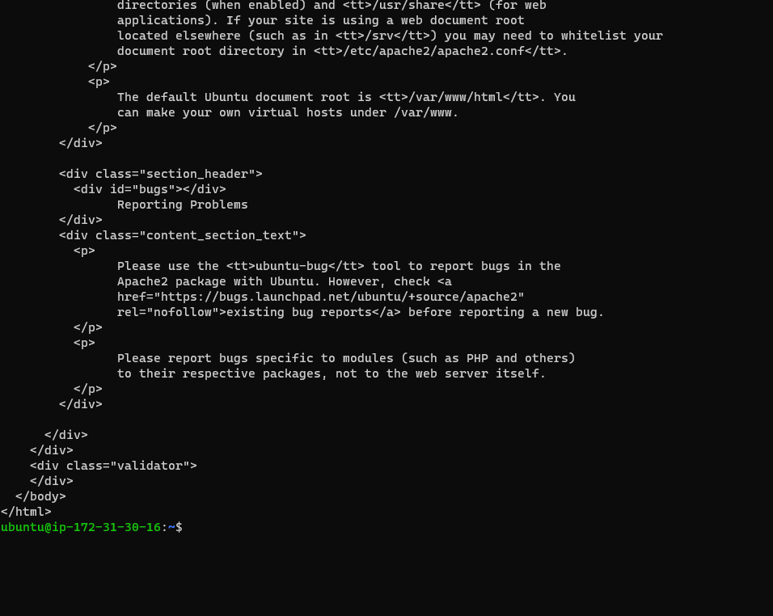

these two command above actually do much the same, they use `curl`command to request our apache HTTP server on port 80(actually you can try not to specify any port , it will wiork anyway), the different is that we try access our service via `DNs` name and in the second by ip address called resolution, we will tourch DSn in futher lecture.

as an output, you can see some strangely formated test, dont worry, we just made sure that our apache web service responded to request from the internet. 
now open the web browser of your choice and try to access the following URL.

1. http://<Public-IP-Address>:80
2. curl -s http://169.254.169.254/latest/meta-data/public-ipv4

IT WORKS !!!!!!!!!!!!

Infacet it is the same content that you previously gotby `curl`, but represented in nice HTML formated by my web browser.

# INSTALLING MYSQL.
step 2. installing MYSQL.
now that you have you have a web server up and running, you need to install a data based management system`(DBMS)`, to be able to store and manage data for your site in a `relational data base`.  MYSQL, is a popular relational data base management system and used with PHP enviroment, so we will use it in our project.

again use   `apt` to aquire and install the software:

`$ sudo apt install mysql-server
`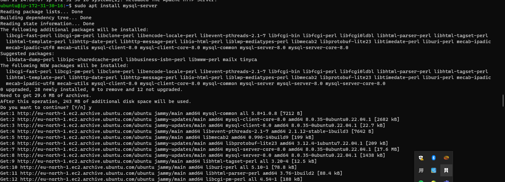
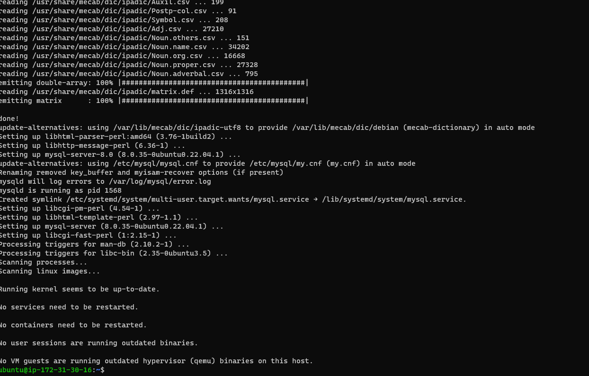

when prompted, confirm installation by pressing`y` then     `enter`

when the installation is finished, log onto the `MYSQL` console by typing
$ sudo mysql
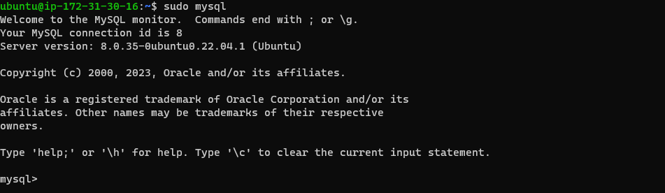

this will connectto the `MYSQL` server as the administrative data base user `root`, which is infered by use of sudo when running this command.  you should see output like this

`Welcome to the MySQL monitor.  Commands end with ; or \g.
Your MySQL connection id is 11
Server version: 8.0.22-0ubuntu0.20.04.3 (Ubuntu)

Copyright (c) 2000, 2020, Oracle and/or its affiliates. All rights reserved.

Oracle is a registered trademark of Oracle Corporation and/or its
affiliates. Other names may be trademarks of their respective
owners.

Type 'help;' or '\h' for help. Type '\c' to clear the current input statement.

mysql> 
`

it is recomended that you run security script that comes pre-installed with `MYsql`, this script will remove some insecure default settings , and lock down access to your dada base system. before running the script you will set a password for the root user, using mysql_native_password as default authentication method, we are defining this users password as `password.1`.

copy the code below:
ALTER USER 'root'@'localhost' IDENTIFIED WITH mysql_native_password BY 'PassWord.1';
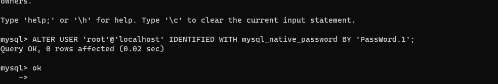

to exit the `MYSQL SHELL, copy the code below`
mysql> exit.

# start the interactive script by running the code:
$ sudo mysql_secure_installation
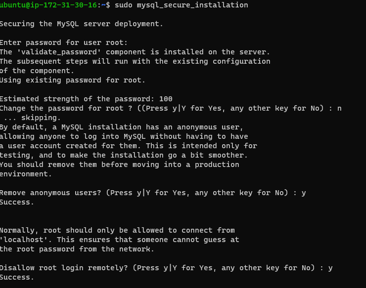
this will ask if you want to configure or validate`password login`
# NB: enebling this feature is somthing of judgement call.
if enabled, password which dont match the specified criteria will be rejected by `MYSQL` witt an error.it is safe to leave the validation disabled, but  you should always use strong unique password for data base credentials.

answer `y` for yes or anyother thing for `no` to continue.
regardless of whether you chose to setup `validation password plugin` your server will never ask you to select pssword for the `MYSQL` root user. this is not to be confused with the system root. 
the data base root user is an administrative user with full previlleges over the data base system. even though the system authentication method for the `MYSQL` root user dispenses the use of password,`even when one is set` you shoul define a stronge password here as an additional safty meature. we will talk about this in a momment.

if you enable the password you will shown the password strnght for the root password you just entered and your server will ask if you want to continue with that password, if you are happy with your current password enter `y`for yes at the prompt.

for forther question, press `y` and hit the enter at each promt, this will prompt you to change the root password, remove some anonymous users and the test database,disable remote root login, and load these new rules so that`MYSQL` immediatly respect the changes you have made.

when you are finished, test if you able to log into th `MYSQL` by typing the codd:`$ sudo mysql -p`
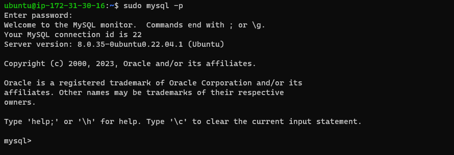

notice the `-p` flag in the command , which will prompt you for the password used after changing the root user password.

 to exit the `MYSQL` console type: `mysql> exit`.

 notice that: you need to provide a password before you connect to the root user.

 for increased security, it is best to have dedicated user account with less expanssive previleges set up for every database, especially if you plan on having multiple data base hosted on your server.

 # note: `at the time of this writing the native mysql php library``mysqlnd`dose not support `catching_sha2 authentication`. the default authentication method for mysql 8. for that reason, when creating data base yuser for php application on mysql 8, you will need to make sure that they are configured to use `mysql_native_password` instead.

 now `mysql` is now installed and secured. next we will install `PHP`, the final component in the lamp stack.

# INSTALLING PHP, STEP 3.
i have `APACHE ` installed to serve my content, and `MYSQL` to store and save my data, `PHP` is the component of our setup that will process code to display dynamic content to end user. in addition to the `PHP` package, you will need `php-mysql`, a `php` modoules that allows `php ` to communicate with `mysql` bassed database. you will also need` libapache2-mob-php` to eneble apache to handle `php` file. core `php` packages will authomatically be installed as dependences.
to install these three packages at once run : `$ sudo apt install php libapache2-mod-php php-mysql`
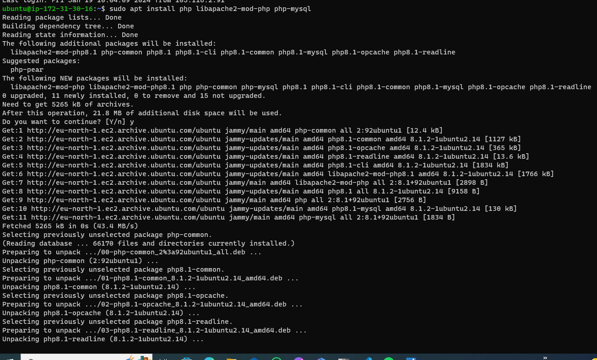
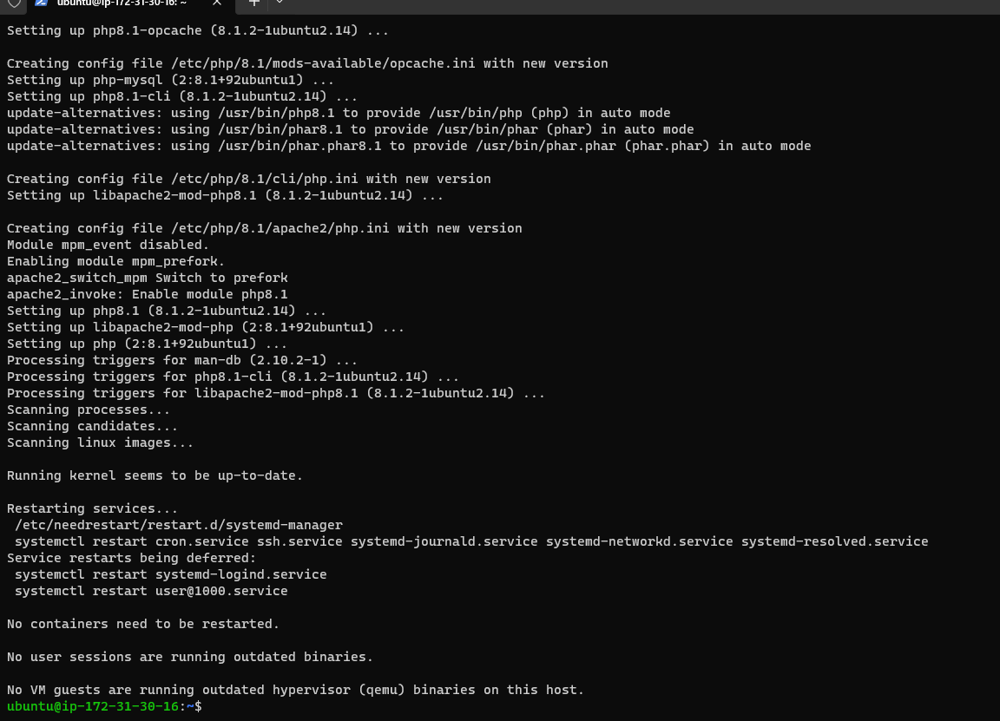

once the instalation is finished you can run the following command to confirm your php version :` php -v ` 
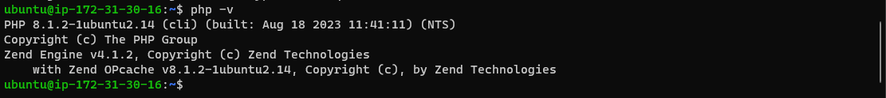

copy the code below : 
`PHP 7.4.3 (cli) (built: Oct  6 2020 15:47:56) ( NTS )
Copyright (c) The PHP Group
Zend Engine v3.4.0, Copyright (c) Zend Technologies`

at this point , your lanp stack is completely installed and oprational.

to test your setup with a `PHP` script, it is best to setuo a proper` apache virtual host` to hold website files and folders., virtual host allows you to have multiple websites located on a single machine and usres of the website will not even notice it. we will configure our first virtual host in the next step.

# STEP FIVE(5), ENABLE `PHP` ON THE WEBSITE.

with the default `directory index` setting in apache, a file name index.html will always take precedence over an index.php file, this is useful for setting up maintainace pages in `PHP` applications, by creating the temporary `index.html` file containing an informative message to visitor. Because this page will take precedence over `index.php` page, it will then become the landing page for the application. once maintainance is over , the `index.html` is renamed or removed from the document root, bringing back the regular application page.

in case you want to change this behavior, you will need to to edit the `/etc/apache2/mods-enabled/dir.conf ` file and chang the order in which the `index.php` file is listed within the `directoryindex` directive.

copy the code below:`sudo vim /etc/apache2/mods-enabled/dir.conf`
copy the cod below
`<IfModule mod_dir.c>
        #Change this:
        #DirectoryIndex index.html index.cgi index.pl index.php index.xhtml index.htm
        #To this:
        DirectoryIndex index.php index.html index.cgi index.pl index.xhtml index.htm
</IfModule>`

 after saving and reloadig the file, you need to reload apache so that the changes take effect.
  copy the code below:
  ` $ sudo systemctl reload apache2`.

  finally we will create `PHP` script to see if `PHP` correctly installed instored and configured in your server.

   now that we have custom location to host our website file and folders, we will create a ` PHP` test script to confirm that `APACHE ` is able to handle and process request for `PHP` files.

   create a new file called index `PHP`, inside your custom web root folder.
   copy the code below:
   `$ vim /var/www/projectlamp/index.php`
   this will opoen a blanck file, add the following text, which is a valid `PHP`CODE, insisde the file

   copy the code below:

   `<?php

phpinfo();`

When you are finished save and close the file. refresh the page and you will see a page similar to this

# creating virtual hiost for your website using apache

inm this project you will set up domain called `projectlamp`, but you can replace this with any domain of your chioce, apache on ubuntu 20.04 has one server block enabled by default that is configured to serve document from`var/www.html directory` we will leave this didrectory as it is  and will add our own directory next next to the default one.

create directory to the `projectlamp` using `mkdir`command as 

follow. click this command  :`$ sudo mkdir /var/www/projectlamp`
next assign ownership of directory with the`$USER` enviroment variable, which will refference your current system user.

copy the code:  `$ sudo chown -R $USER:$USER /var/www/projectlamp  `

then create and open a new configuration file in `Apache` `site available`directory using preffered command -line editor, here we will be usin `-vi` or `vim` (they are the same by the way)

copy the code below :`$ sudo vi /etc/apache2/sites-available/projectlamp.conf ` 

this will create a new blank file, paste in the following `bare bone configuration by hitting on i on the keyboared` to enter the insert mood and paste the next text below:
<VirtualHost *:80>
    ServerName projectlamp
    ServerAlias www.projectlamp 
    ServerAdmin webmaster@localhost
    DocumentRoot /var/www/projectlamp
    ErrorLog ${APACHE_LOG_DIR}/error.log
    CustomLog ${APACHE_LOG_DIR}/access.log combined
</VirtualHost>

to save the file simply follow the step
hit th `esc` botten on the keyboared
type `:`
type `wq`. w for write and q for quit
hit enter to save the file.

you can use `ls` command to show the new file in the site available directory.  click the code below: `$ sudo ls /etc/apache2/

sites-available:
You will see something like this
000-default.conf  default-ssl.conf  projectlamp.conf`
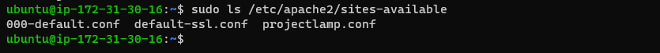

with this virtual host configuration you are telling apache serve `projectlamp` using : var/www/projectlamp as its web root directory, if you would like to test apache without a domain name, you can remove or comment out the options server name alias by adding a `#` character there will tell the programme to skip proccessing instruction on those line.

you can now use `a2ensite` command to eneble the new virtual host.
 type :`$ sudo a2ensite projectlamp`

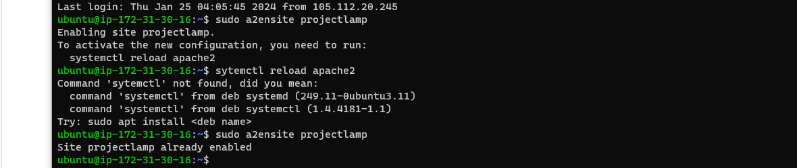

you might want to disable the default website that came with installed with apache, this is require if you are not using a custom domain name, because in this case apache default con figuration would overwrite your virtual host, to disable apache difault website use a2dissite command, type

`$ sudo apache2ctl configtest`

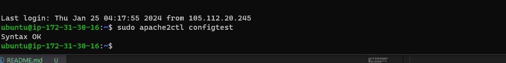

make sure your configuration does not contain syntax error. run below` $ sudo apache2ctl configtest`

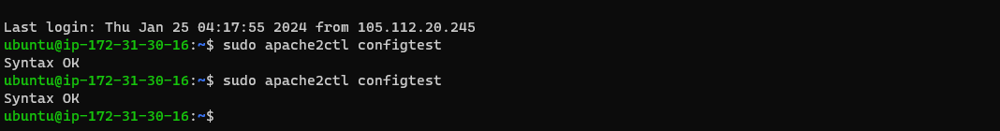

finally reload `apach` so that these changes takes effef, by clicking :`$ sudo systemctl reload apache2`

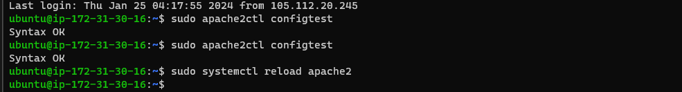

your new website is now active but the web root/var/www/projectlamp is still empty. `create an index.html file in that location` so that we can can test the virtual host works as expected.

copy the code below:  ` sudo echo 'Hello LAMP from hostname' $(curl -s http://169.254.169.254/latest/meta-data/public-hostname) 'with public IP' $(curl -s http://169.254.169.254/latest/meta-data/public-ipv4) > /var/www/projectlamp/index.html`

now go to your browser and try to open your browser using ip address: `http://<Public-IP-Address>:80`

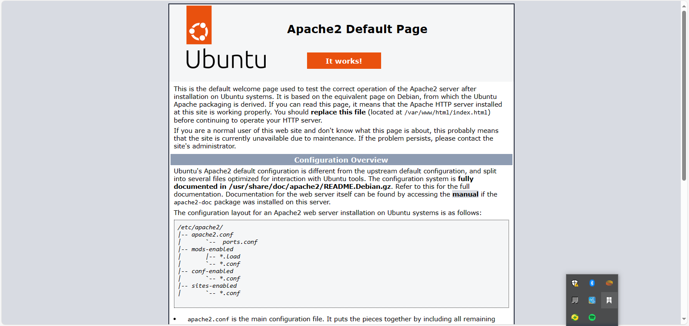
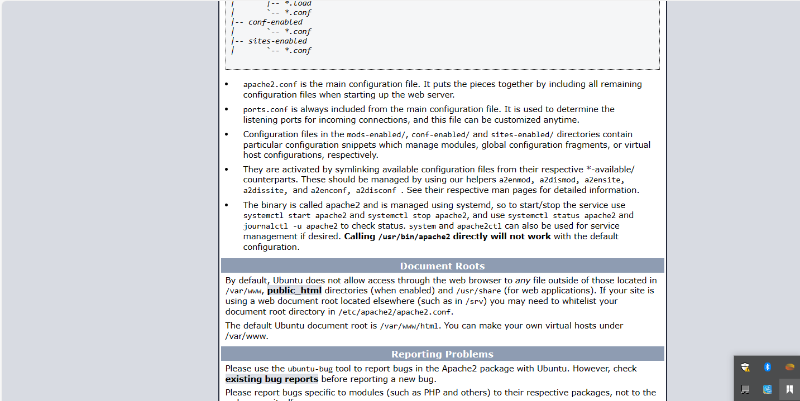

if you see the text from `eco` command you wrote to index.html file, then it means your apache web service is working as expected, in the output you will see your server public hostname(DSN name) and public `ip address`, you can also access your website in your browser by public `DNS NAME` and public `ip address`, you can also access your website by `publicv DNS NAME`, NOT ONLY BY `IP` try it out and the result must be the same(port is option).

` http://<Public-DNS-Name>:80`

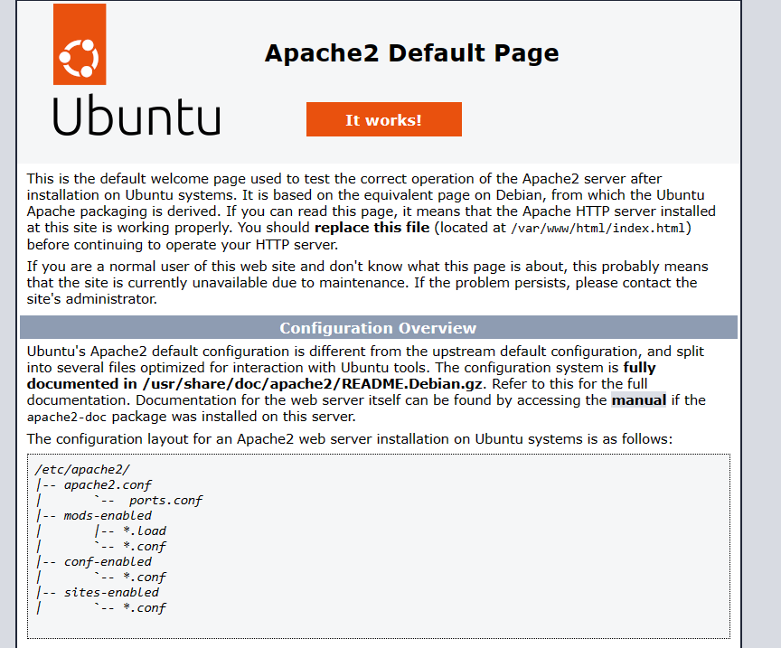
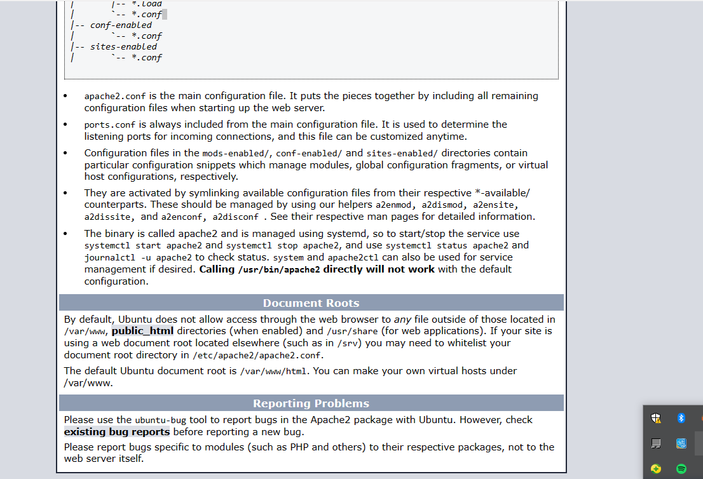

you can leave this file in place as landing page until you setup an `index.php` to replace it, once you do that , remenber to replace or rename the `index.php` from your document root, as it will take precedence over an `index.php` by default.