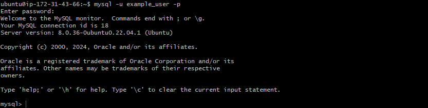
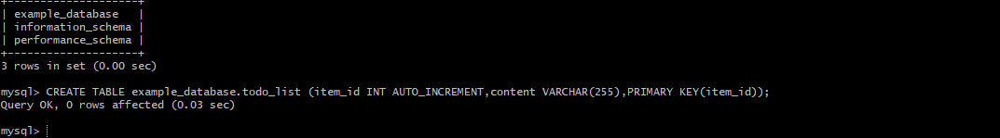

As we embark on an exciting jouney with the project `(lemp stack)` course, you will be introdueced to building and instaling web applications using `(lemp stack)` , this comprehensive course/project take you through a hand-on adventure, guilding you step by step in hernessing the power of linux,Nginx, MYSQL, and PHP, to create a dynamic performing website, we will dive into the architecture of `lemp stack`, understanding hoe linux provides a solid foundation, Nginx server as a poweful web server, MYSQL handles the database, and PHP handles server site functionality.

through out the course/project we will set uo a linux enviroment, configure NGINX for optimum performance, manage MYSQL data base , and develop PHP code to bring application to life, through the practical hands on excersise, you will gain proficiency in building a dynamic website with the lemp stack, we will explore technics for handling users request, interacting with data base, processing form and implementing robost security meatures, futher more introduce you to popular development frame work, and tool that can elevate productivity and simolyfy the web application devepment proccess. By the end of the project `lemb stack` course/project, you will have experience setting up the full`LEMB STACK` and create remakable high performance web application.

# web stack implementation `(lemp stack)`
  project 2 covers the concept of project 1, and help to cement your skill of deploying web solution using LA(E)MP STACK. we have done a great job in compleation of project 1,
   in this project we will be imimplementing a similar stack ,but with an alternative web server -`NGINX`,which is very popular and widely used by many website in the internet

   `#  SIDE STUDY:1., make sure you get basic knowledge on SQL SYNTAX and most commonly used command
   # `2. be confortable using not only vim, `but also nano editor as well, get to know basic nano command.
   `hint :` in the previous project used putty on windows to connect to our EC2  instance, but there is a simpler that we do not require conversion of `.pem`key to `.ppk` -using git bash

   run git bash and run the the following command: `ssh -i <Your-private-key.pem> ubuntu@<EC2-Public-IP-address>` 

#INSTALLING THE NGINX WEB SERVER
step 1,. in order to display web pages to our site visitors, we are going to employ `NGINX`, a high performance web server, we will use the `apt` package manager to install this package, sice this is our dirst time time using `apt` for this session, start up by updating your web server pakage index, following that , you can use` apt install` to get `NGINX` installed. copy the code below
1: `sudo apt update`
2: `sudo apt install nginx`

when prompted enter `y`to confirm that you want to install `Nginx`, once the installation is complete then `Nginx` web server will be active and running on your ubuntu.

to veryfy that that `Nginx ` was successfully installed and running on yoyr ubuntu, run :`sudo systemctl status nginx `
 

 if it is green and running , then you have just lunched your first web server correctly in the cloud

 
 our server is running and we can access it locally and from the internet(source 0.0.0.0/0 means from any ip address)
 

 firstly lets try to see how we can access it locally, in our ubuntu shell, run
  `$ curl http://localhost:80 or
$ curl http://127.0.0.1:80`
these two command above prety do much the same-  thet use `caul` command to request our `nginx on port 80`(acctually you can even try not to specify any port- it will work anyways. ) the difference is that in the first case we try to acces our service through `DSN NAME ` and in the second one by `IP ADDRESS`, (in this case ip address127.0.0.1 correspond to DNS name 'LOCAL HOST"  and the proccess of converting a DNS namd to an ip adreess is called resolution) , we can still touch DNS in futher in futher lecture and project, as an out put you can see some strangly formated text, do not worry , we just made sure that our `nginx` web server respond to curl command with some payload.

now its time for us to test how our `nginx` server can respond to request from the internet, open a web of your choice and try to open the following `url` ` http://<Public-IP:80]

another way to retrieve your public `ip`address , other than to check in `AWS` WEB CONSOLE, is to use the following command `curl -s http://169.254.169.254/latest/meta-data/public-ipv4`

the url in the browser shal work if you do not specify port nunber, since all web browser use port 80by default, if you see the images uploaded above then your web server is now correctly installed and accessable through your fire wall.

infact this is the same content that you previously goty `curl` command but represented in `html` formating by your web browser.

# INSTALLING MYSQL
Now that you have A WEB SERVER UP AND RUNNING, You need to install a `DATA MANAGEMENT SYSTEM, to be able to store and manage data for your site in a rational data base`.
 `MYSQL` is a rational database management system used within` PHP` enviroment, so we will use it in our project.

 again use `apt` to aquire and install this software
 `$ sudo apt install mysql-server`

 
 when the prompt confirm installation , press yes and then enter; when the installation is complete, log into the `MYSQL` console by clicking  `$ sudo mysql`
 

it is recomended that you run a security script that comes pre-installed with `myaql` , this script will remove some insecure dfalt setup and lock down access to your database system. before running the script you will set up a password for the root user, usin mysql_native password as default authentication method, we are defining this user's password as `password.1`.

copy the code below : `ALTER USER 'root'@'localhost' IDENTIFIED WITH mysql_native_password BY 'PassWord.1';`

this will ask if you want to configure the `VALIDATE PASSWORD PLUGIN`
NOTE: enabling this feature is somthing if a judgemental call, if enebled password which dont match the specified criteria, it will be rejected by `MYSQL` with an error, it is safe to leave validation disabled , but you should always use strong unique password for database credentials. 
answer yes for yes , and any other thing to continue without enabling`

 `VALIDATE PASSWORD PLUGIN can be used to test passwords
and improve security. It checks the strength of password
and allows the users to set only those passwords which are
secure enough. Would you like to setup VALIDATE PASSWORD plugin?`

`Press y|Y for Yes, any other key for No:`

if your anser is yes you will be asked to select a level of password validation , keep it in mind that if you enter 2 for the strongest level, you will receive error when atempting to set any other password which does not contain numbers,upper case and lower case letters, and special character, which is based on common dictionary word `password.1`

`copy the code below : There are three levels of password validation policy:

LOW    Length >= 8
MEDIUM Length >= 8, numeric, mixed case, and special characters
STRONG Length >= 8, numeric, mixed case, special characters and dictionary              file

Please enter 0 = LOW, 1 = MEDIUM and 2 = STRONG: 1`

Regardless of whether you chose to setup a password for `VALIDATE PASSWORD PLUGIN`, your server will ask yoy to confirm  a password for `mysqll root user` , this is not to be confused with system root, the `database root` user is an administrative user with full previleges over the data base system, even though the default authentication method for `MYSQL ROOT` user dispenses the use of a password, even when one is set, you should define a strong password here as an additional safty measure. we will talt about this in a moment.

if you eneble password validation you will be shown the password strenght for the root password you just entered, and you server will ask if you want to continue with the poassword, if you are happy with you current password enter `y` for yes at the prompt.

copy the code below  : `Estimated strength of the password: 100 
Do you wish to continue with the password provided?(Press y|Y for Yes, any other key for No) : y` 

for the rest of the question, press `y` and hit `enter`  key at each prompt , this will prompt you to change the root password , remove some anonymous users and test the data base ,disable remote login, and load this new ruls so that `MYSQL` immediatly respect the changes you have made, when you are finished test if you are able to log into the mysql console by typing this ;`sudo mysql -p`

note; the `p` flag in this command will prompt you for the password used after changing the root users password . 

to exit `mysql` concoole type :`mysql> exit`

note: you need to provide a password to connect as the root user. for increased security it is best to have a dedicated users account with less expenssive previleges setup for every data base , especially if you plan on havin multiple data base hosted on your server

`Note: At the time of this writing, the native MySQL PHP library mysqlnd doesn’t support caching_sha2_authentication, the default authentication method for MySQL 8. For that reason, when creating database users for PHP applications on MySQL 8, you’ll need to make sure they’re configured to use mysql_native_password instead. We’ll demonstrate how to do that in Step 6.`

Now my `mysql is ` installed and secured ,next we will install `PHP`, the final component in `LEMP` STACK.

# INSTALLING   PHP.

you have `Nginx` installed to serve your content and `Mysql` installed to store and manage your data, now you can install `PHP` to process code and generate dynamic content for the web server.

 While `apache` enebles `PHP` interpreter in each request, `Nginx requres an external programme to handle processing and act as a brigde between `PHP` and interpreter its self, and the web server,   
This allows for a better over all performance in most `PHP` based web site, but it requires additional configuration, you will need to install `Php-fpm`,        which stands for                     `php fastCGI process manager` , and tell Nginx to pass PHP request to this software for processing. additionally, you need `php mysql`, a PHP modouls that allows PHP to communicate with `myaql`-based data base, core PHP packages will automatically be installed as dependencies.  to install these two packages once  , copy the code below :`$ sudo apt install php-fpm php-mysql`

when prompted type `yes` and `enter` to confirm installation.

you niow have your `php` component installed, next you will configure `Nginx to use them. 

# CONFIGURING NGINX TO USE PHP PROCESSOR

When using the nginx web server, we can create server block(similar to virtual host in apache) to encapsulate configuration details and host more than one domain on a single server. in this guide , we will use project `LEMP` as an example domain name.

on ubunt 20.04, Nginx has one server block enabled by default and its and its configured to serve document out of a directory at`/var/www/html`., while this works well for a single site, it can become dificult to manage if you are hosting multiple site.

creat the root web directory for `your_domain` as follow: 
copy the code : `$ sudo mkdir /var/www/projectLEMP`

next, assign ownership  of the directory with the `$USER` enviroment variable, which will reference your current system user:
copy the code: `$ sudo chown -R $USER:$USER /var/www/projectLEMP`

then open a new configuration file in `Nginx's ` `sites-avalaible` directiry using your prefered command-line editor, here we will use `nano` coppy the code :`$ sudo nano /etc/nginx/sites-available/projectLEMP`,
 this will create a blank file, paste in the following bare-bones  configuration. copy the code below: `#/etc/nginx/sites-available/projectLEMP

server {
    listen 80;
    server_name projectLEMP www.projectLEMP;
    root /var/www/projectLEMP;

    index index.html index.htm index.php;

    location / {
        try_files $uri $uri/ =404;
    }

    location ~ \.php$ {
        include snippets/fastcgi-php.conf;
        fastcgi_pass unix:/var/run/php/php8.1-fpm.sock;
     }

    location ~ /\.ht {
        deny all;
    }

}`

when you are done editing, save and close the file, if you are using `nano,` yoy can do so by typing`CNTL+X, and then y and enter to confirm.`

Activate your cofiguration by linking the config file from `Nginx` `site-enabled` directory:  copy the code below: `$ sudo ln -s /etc/nginx/sites-available/projectLEMP /etc/nginx/sites-enabled/`

this will tell Nginx to use the configuration next time it is re;loaded, you can test your configuration for syntax error by typing : `$ sudo nginx -t`

if any errors are reported go back to your configuration file to review its contents before continuing.

we also need to disable defaul Nginx host that is currently configured to listen on port 80; fo this to run:

copy the code below: `sudo unlink /etc/nginx/sites-enabled/default`

when you are redy, reload Nginx to apply the changes. copy the code below: `$ sudo systemctl reload nginx`.

your new web site is now active, but the web root/var/www/projectLEMP/ is still empty. creat an index.html file in that location so that we can test that your new server blocks works as expected. coppy the code below: `sudo echo 'Hello LEMP from hostname' $(curl -s http://169.254.169.254/latest/meta-data/public-hostname) 'with public IP' $(curl -s http://169.254.169.254/latest/meta-data/public-ipv4) > /var/www/projectLEMP/index.html`

now copy the code below, `:http://<Public-IP-Address>:80`

if you see text from `echo` command you wrote to index.html, that means Nginx site is worhing as expected, in the output you will see your server public host name(DNS name) and public IP address, you can also access your website in your browser by public `DNS` name, not only by IP- try it out, the result must be the same(port is optional)
copy the cod below:`http://<Public-DNS-Name>:80`

you can leave this file in place as your temporary landing page for your applications until you st up your `index.php` file to replace it, onece you do that remenber to replace or `rename index.html` file from your document root, as it will take precedence over an `index.php` file by default.

the `LEMP STACK` is now fully configured, in the next step we will create a `PHP` script to test that the Nginx is infact able to handle `.php` files within your newly configured website.

# TESTING PHP WITH NGINX

your `LEMP STACK` should now be completly set up, at this point set up and fully operational, and you can teest it it to ensure that `Nginx` can correctly handle `.php` files off to your PHP processor. you can do this by creating a test PHP file in your document root. open a new file called document root . open  a new file called `info.php` in your document root with your text editor. copybthe code below : `$ nano /var/www/projectLEMP/info.php`

type or paste the file into the new line, this is valid PHP code that will run information about your server. 
copy the code below:
``<?php`
`phpinfo();`

you can now acces this page in your web browser by visiting the domain name or public ip adrress you have set up in your Nginx configuration file, followed by `/info.php` :

copy the code below : `http://`server_domain_or_IP`/info.php`

you will see web page containing detailed information about your server.

after checking the relevant information about your PHP server through this page, it best you remove the file you created as it contains sensitive information about your PHP enviroment. you can use `rm` to remove this file. copy the code below:` $ sudo rm /var/www/your_domain/info.php`
 

you can alwas generate this file if you need it later.

# RETRIEVING DATA FROM MYSQL DATA BASE WITH PHP

In this step you will create a test data bese(DB) with simple to do list , and configure access to it, so th Nginxwebsite would be able to query data from the `DB` and display it.

At this time the native   MYSQL PHP library`mysqlnd` dose not support `caching_sha2_authentication`, the default authentication method for MYSQL 8, we will need to create a new user with the `mysql_native_password` authentication method in order to be able to connect with the `Mysql data base`from PHP.

We will create a data base named `example_database`, and user name example user, but you can replace this names with different values.

first connect to `mysql console` using the root account. copy the code below: `$ sudo mysql`
to create data base run the following comand :`mysql> CREATE DATABASE `example_database`;

the following command creates new user named `example_user`, using mysql_native_password as default authentication method, we are defining this users password as `password_1` , but you should replace this value with a secured password of of your choice.

copy the code below: `mysql>  CREATE USER 'example_user'@'%' IDENTIFIED WITH mysql_native_password BY 'PassWord.1';`

now we need to give this user permission over the`example_database` database. copy the code below; `mysql> GRANT ALL ON example_database.* TO 'example_user'@'%';`

this gives `example_user` full previlleges to example `data_base`, while preventing this user from creating or modifying other data base on your server.  now exit mysql shell with :`mysql> exit`

now you can test if the new user have the processor permission by logging in to the MYSQL console again, this time using the custom users credentials.

copy the code:`$ mysql -u example_user -p`

notice the `-p` flag in the command, which prompt you for the pass word use when creating the `example_user` user., after loging into the mysql console confirm that you have access to the` example_database` database.
copy the code below: `mysql> SHOW DATABASES;`

now we will create a test table name `tedo_list` from the mysql console, run the following statement:`CREATE TABLE example_database.todo_list (item_id INT AUTO_INCREMENT,content VARCHAR(255),PRIMARY KEY(item_id));`

insert few rows of content in the test table,you might want to repeat the next command a few times, 
copy the code below: `mysql> INSERT INTO example_database.todo_list (content) VALUES ("My first important item");`

to confirm that your data was successfuly saved , run: `mysql>  SELECT * FROM example_database.todo_list;`

after confirming you have a valid data in your test table, you can exit the mysql console.

now you can create a PHP script that will connect with mysql and query for ypour content, create a new PHP file in your customweb root using your prefered editor, we will use `VI` for that.

copy the code below: `$ nano /var/www/projectLEMP/todo_list.php`

the followin PHP script connect with the mysql data base and queries for the content of the `tedo_list` table, display the result in a list, if there is a problem with the database connection,it will throw an exception. copy the content into your`todo_list.php` script.:
<?php
$user = "example_user";
$password = "PassWord.1";
$database = "example_database";
$table = "todo_list";

try {
  $db = new PDO("mysql:host=localhost;dbname=$database", $user, $password);
  echo "<h2>TODO</h2><ol>";
  foreach($db->query("SELECT content FROM $table") as $row) {
    echo "<li>" . $row['content'] . "</li>";
  }
  echo "</ol>";
} catch (PDOException $e) {
    print "Error!: " . $e->getMessage() . " ";
    die();
}

you can now access the page in your web browser, by visiting the domain name or public IP address configured for you website, followed by `/todo_list.php`

. copy the code below:`http://<Public_domain_or_IP>/todo_list.php`.

