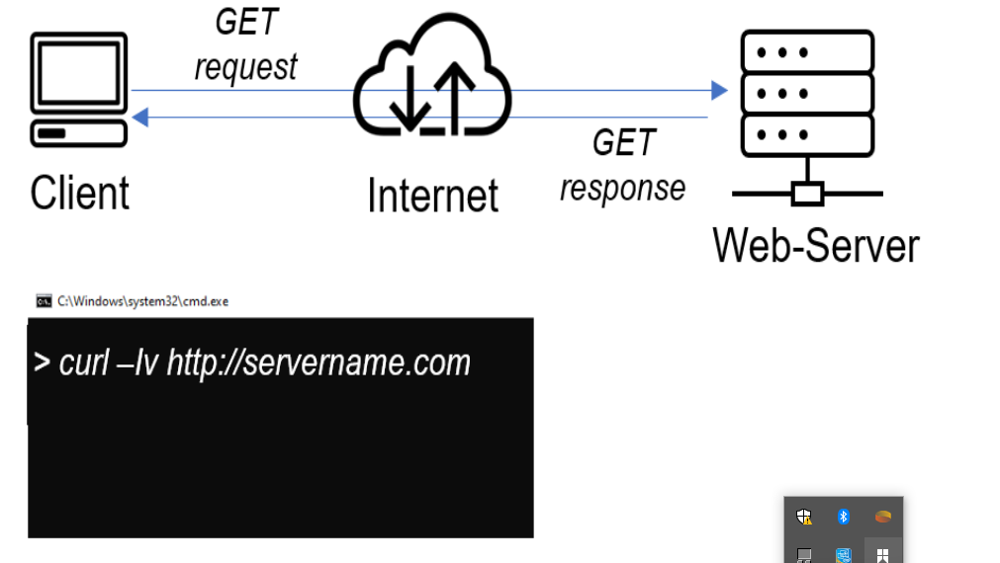
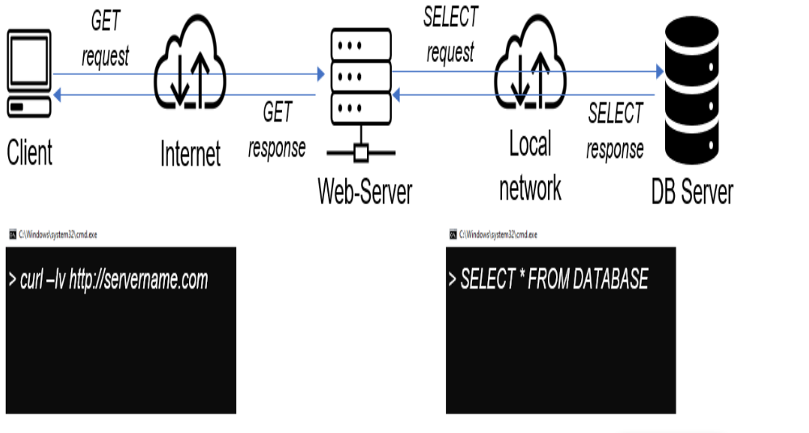
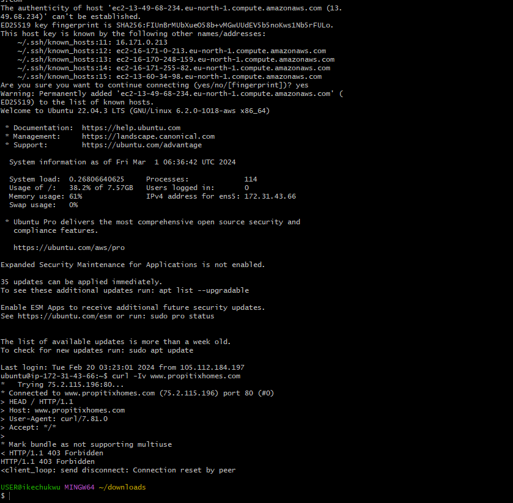
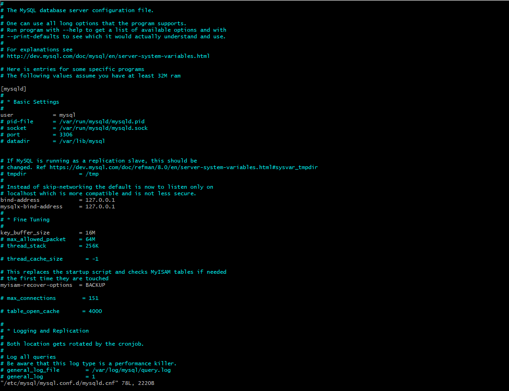
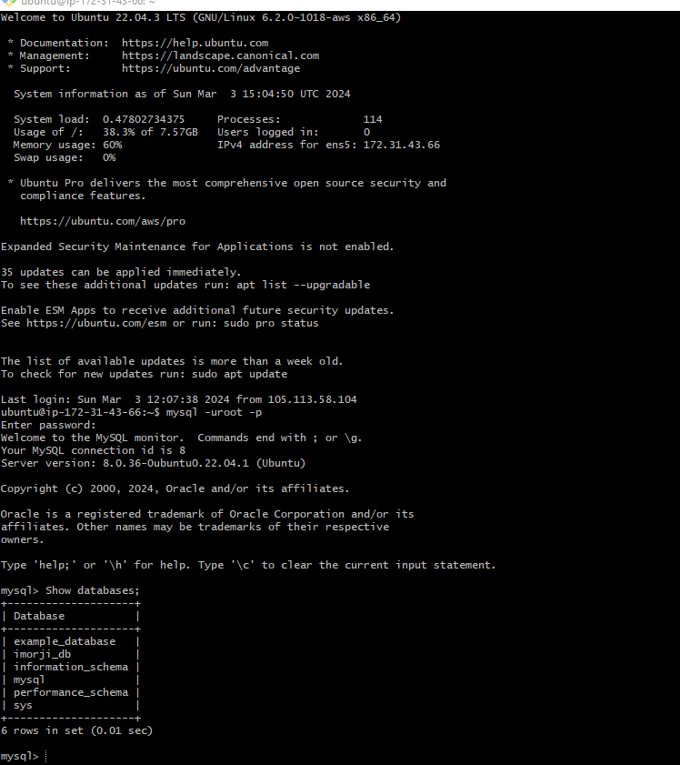
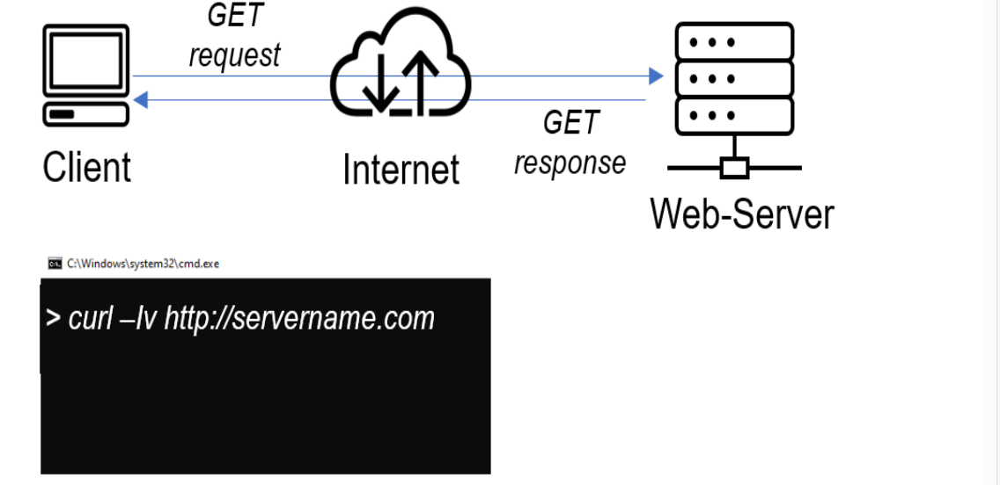

# UNDERSTANDING CLIENT SERVER ARCHITECTURE WITH MYSQL AS RDBMS.

Explore the intricases of client-server architecture using `MYSQL` as the     `RDBMA` in this enlightining project. Gain a comprehensive understanding of data management, connectivity and communication between client and server through insightfull explanation and practical example.

### CLIENT SERVER ARCHITECHTURE WITH MYSQL.

###### : CLIENT SERVER ARCHITECTURE.
As you procceed your journey into the world of `IT` you will begin to realize that certain concept apply to many other areas, one of such is `client server architecture`

client server refers to an architecture in which two or more computers are connected together over a network to send and recieve request over one another.      In thier communication each machine has its own role; `the machine sending request is usually refered to as client` and the `machine responding is (serving) is called server`.

A SIMPLE DIAGRAM IS REPRESENTED BELOW.

inthis diagrame above, the machine is trying to access a wwebsite using web browser or simply`curl` command is a client and it send `HTTP` request to web server(APACHE,NGINX,ISS or any other), over the internet.

if we extend this concept futher and add a data base server to our architecture, we can get this picture. ;

In rhis case our web server have a role of a `client` that connects/writes to/ from a data base(DB) server(MYSQL,mongoDB,oracle,SQL server or any other.), and communication between then happens over a local network(it can also be internet connection, but it is a common practice to place web server and DB close to each other in local network).

The setup on the diagram above is a typical web stack architecture that have been implemented in previous project(LAMP,LEMP,MEAN and MERN), this architecture can be implemented with many other technology- various web and DB severs, from small single page application `SPA` to large and complex portal.

# REAL EXAMPLE OF` LAMP` WEBSITE.
in project 1, i implemented  a `LAMP` stack website, let us take an example of commercially deployed `LAMP` website :`propitixhomes.com`
this `LAMP` network server can be located anywhere in the world , and you can reach it also from any part of the globe, over global network internet,

assuming that you go on your browser,and type in there :`propitixhomes.com`, it means that your browser is considered the `client` essentially, it is sending request to the romote server, and in turn wiould be expecting some kind of response from the remote server.

lets take a quick example and see `client-server` communication in action. open your ubuntu or terminal and run`curl` command :`$ curl -Iv www.propitixhomes.com`

note: if your ubuntu does not have `curl`, you can download it by running :`sudo apt install caurl`

in this example , your terminal will be client, while `propitixhomes.com` will be server, see the responce from the remote server in below, you can also see that the request from the URL is being serverd by a computer with an `IP address:172.31.43.66on port: 80.` more on IP addresses when we get to network related projects.
another simple way to get a server IP address, is to use a server diagonistict tool like `PING`, it will also show sound-trip-time -time for parckets togo and bank from the server, this tool uses `ICMP PROTOCOL`.

side self study:
1. read about `ping` and `traceroute` network diagonistic utility. be abale to make sence out of the result of using this tools.

2. refresh your knowledge on basic`SQL` command, be able to perform simple `show , drop, select and insert sql` queries.

# IMPLEMENTING A CLIENT SERVER ARCHITECTURE USING MYSQL DATA BASED MANAGEMENT SYSTEM.
###   TASK:
TO DEMONSTRATE A BASIC CLIENT SERVER USING `MYSQL RDBMS`, FOLLOW THE INSTRUCTION BELOW.
1. create and configure two linux-based vertual server(`EC2 INSTANCE IN AWS`) 

COPY THE CODE BELOW: Server A name - `mysql server`
Server B name - `mysql client`

2. on `mysql server` linux server install `mysql server software`

interesting fact: `MYSQL` is a open source relational database management system, its name is a combination of `MY` the name of the co founder michael widenius's daughter, and `SQL` the abbreviation for structured quary language.

3. on `MYSQL CLIENT` linux server install mysql client software.

4. by default both your`EC2` vertual servers are located in the same local vertual network, so they can communicate to each other using local `IP ADDRESSES`  use `MYSQL` servers local ip address to connect from `mysql client`. `MYSQL `server uses `TCP` port `3306` by default, so you will have to open it by creating a new entries in `inbound rules` in `mysql server` `security group`, for extra security donot allow all ip to reach your `mysql` server-- allow access only to the specific local ip address of your `mysql client`;

5. you might need to configure mysql server to allow connection from remote host.

from `mysql client` linux server connects remotely to `mysql server` database engine without using `SSH` you must use the mysql utility to perform this action.

7. check that you have successfully connect to a remote MYSQL server and can perform SQL quaries.

copy the code below: Show databases;

if you see an output similer to the image below, then you have successfully conpleted this project.

you have deployed a fully funtional`MYSQL client set up`. welldone, you are getting there gradually, you can futher play arround with this set up and practince in creating dropings database, table and interseting/selecting records to and from them.

