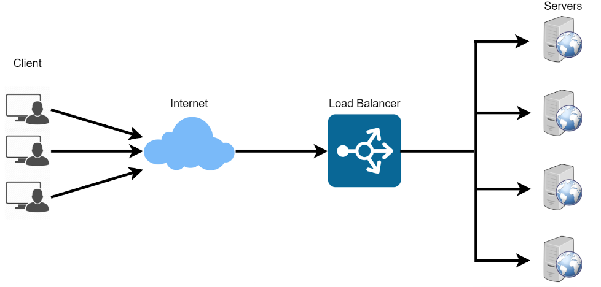
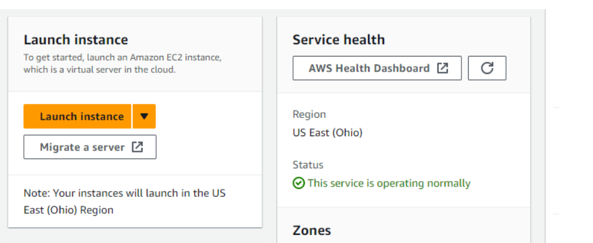
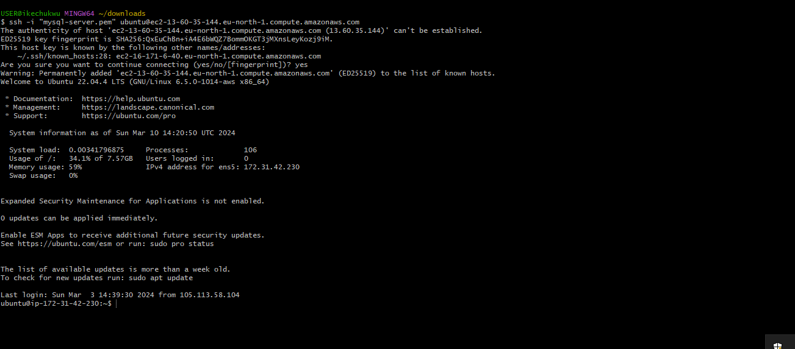
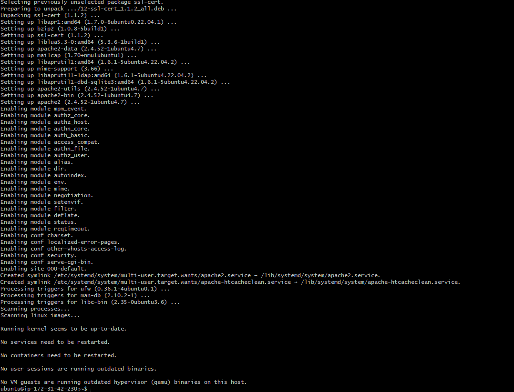
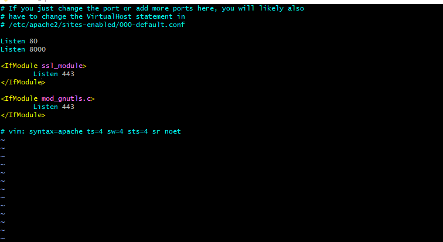
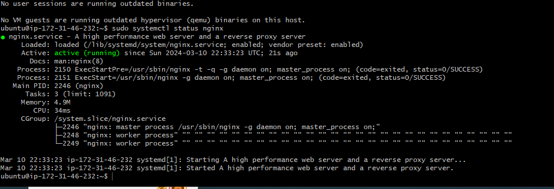

# IMPLEMENTING LOADBALANCERS WITH NGINX.
Discover the art of load balancing with `NGINX` in this project, learn how to distribute trafic efficiently accross multiple servers, optmise performance and ensure high availability for your web applicatiion.

load balancing is like having a team of helper working together to make sure a big job get done smoothly and efficiently, immagine you have a lot of heavy boxes to carry, but you cant carry them all by your self because they are too heavy, load balancing is when you call your friends to help you carry boxes, each friend takes seome of the box and carry them to the right place, this the work gets done faster beacause every one is working together.

in computer languege; load balancing means distributing the work or task among several computers, so that no one computer gets over loaded with too much work. these helps to keep every thing running smoothly, and ensure that networks and apps runs smoothly and ensure that network and app works quickly and dont get too slow. its like team work for computers.

`Nginx` is a versatile software, it can act like a web server,reverse proxy, and a load balancer etc,. all that is needed is to configure it properly to serve your use case.

in this project we will be working through how to configure `NGINX` as a load balancer.

# SETTING UP A BASIC LOAD BALANCER.

we arevgoing to be provissioning two EC2 instances running ubuntu
 `22.04` and install apache web server in them, we will open port 8000, to allow trafic from anywhere and finally update the default page of the web server to display thier poublic `IP` address .

 next we will provide another `EC2` running ubuntu `22.04` this time we will install `NGINX` and configure it to act as a load balancer distributing trafic accross the web server.

 # step 1. provissioning `EC2 ` instance.;  

 1.  open your AWS management console , scrol down the page then click on lunch instance.
 2. under name , provide a unique name for ech of your instances
 
3. under application and os image ,click on quick start and click on ubuntu:
4. under pair,click on create  new pair if you do not have one, you can use the same key pair for all the instances, ensure you have access to the key pair before you lunch instance.
5. and finally lunch instance.

# step 2.

open port 8000, we will be running our server on port 8000, while the load balancer runs on port 80.  we need to open port 8000 to allow trafic from anywhere, to do this we need to add a rule to security group to each of the web servers
1. click on instance id, and get the details of your Ec2 instance.`
2. click on security group:
3. add your rules and save rules

#.   INSTALL APACHE WEB SERVEER
After provisioning both of our server and have opened the neccesary port, its time to install apache software on both server, to do so we must first connect to each of the web server via `ssh`, then we can now run commands on the terminal of our web servers.

1. to connect the web server; click on your instance id at the top of the page and click connect
2. click and enter and type yes when prompted. you should be connected to a terminal on your instance
3. next install appache with the command bellow : `sudo apt update -y &&  sudo apt install apache2 -y`

verify that apache is running using the code below : `sudo systemctl status apache2`

# STEP 4
configure apache to server a page , showing its public `IP`

we will start bu configuring  apache web server to serve content on `port :8000` , instead of its defalt wich is `port :80 `, then whem we creat a nwe `index.html` file, the file will contain code to be display to the public of the EC2 instance, we will then overide apache web servers default html file with ou new file

### . `configure apache serve on port 8000`

1. using text editor, open the file /etc/apache2/port/conf

2. add a new listen directive to port `8000` first type i to switch the editor ti insert the mood, then add the listen directive then save your file

3. open the file/etc/apache2/site-availaible/000-default.conf and change port 80 on the virtual host to 8000, like the screan shot 

4. copy the file by first pressing  the `esc` key on your key board, then the command below : `:wqa!`

5. restat apache to load the new configuration using this command :`sudo systemctl restart apache2`

# CREATING A NEW HTML FILE

1. open an index.html file with the command : `sudo vi index.html`

2. swith `vi` editor to insert mood and paste the html file below. before pastingthe html file, get the public `ip address` of you ec2 instance from aws management console and replace the placeholder text for ip address in the html file. 
copy the code below :         <!DOCTYPE html>
        <html>
        <head>
            <title>My EC2 Instance</title>
        </head>
        <body>
            <h1>Welcome to my EC2 instance</h1>s
            
Public IP: YOUR_PUBLIC_IP

        </body>
        </html>

3. chang the ownership of index.html file with the command below :`sudo chown www-data:www-data ./index.html`

#  OVERRIDING THE DEFAUL HTML FILE OF APACHE WEB SERVER:

1.  replace the defalt html file with the new html file using the command below : `sudo cp -f ./index.html /var/www/html/index.html`

2. restart the web server using the the new configuration command below. copy the code below :` sudo systemctl restart apache2`

3. you should find a web on a browser like so:

# STEP 5 CONFIGURE NGINX AND LOAD BALANCER

1. provisiomn a new running EC2 instance running 22.04, make sure port 80 is open to accept trafic from any where, you can refer to step 1 through step 2 to refress your memory
2. next SSH into instance. again refresh to step 3 for refresher memeory

3. install nginx into the instance using the command below : `sudo apt update -y && sudo apt install nginx -y`

4. verify that NGINX is working,  copy the code `sudo systemctl status nginx`

5. open eginxnw cofiguration file with the code belowwith the 
`:sudo vi /etc/nginx/conf.d/loadbalancer.conf`

paste the configuration file below to enable nginx to serve as aload balancer, a screen shot configuration of the file is shown below, make sure vyou edit the file and provide necesary information, like your server ip etc. copy the code :        
        upstream backend_servers {

            # your are to replace the public IP and Port to that of your webservers
            server 127.0.0.1:8000; # public IP and port for webserser 1
            server 127.0.0.1:8000; # public IP and port for webserver 2

        }

        server {
            listen 80;
            server_name <your load balancer's public IP addres>; # provide your load balancers public IP address

            location / {
                proxy_pass http://backend_servers;
                proxy_set_header Host $host;
                proxy_set_header X-Real-IP $remote_addr;
                proxy_set_header X-Forwarded-For $proxy_add_x_forwarded_for;
            }
        }
    
`upstream benked server` define a group of benked server. the server lines inside the upstream blocks list the addresses and port of your benc ked server. proxy _pass inside the `location` block set up the load balancing, passing the request to the bencked server.
`the_proxy_set_header` lines pass neccesary header to the bencked server to correctly handle the request

6. test configuration with command below: `sudo nginx -t`
copy the configuration below : `sudo systemctl restart nginx`

7. paste the public `ip address of Nginx load balancer`, you should see the same wed pages served by the web servers.

#. LOAD BALANCING ALGORYTHMS.

load balancer algorithms are techniques used to distribute incomming networks, traffics or work load accress multiple server, ensuring efficient utilisation of resources and providing overall system performance , reliability and availability. here are some common load balancer algorithms.

1. round robin: this algorithm distribute request seqentialy to each server in the pool, it is simple to implement and ensure an even distribution of trafic. it works well when all servers have similar  capabilities and resources

2. list connection : this algorith rouths new request to the server with the list number of active connection. it is effective when server have varying capacities or work load, as it helps distribute traffic to the least busy server.

3. weighted round robin : similar to the round robin algorythm, but servers are assigned different weight based on their capabilities. server with high capabilities recieve more request, this approach is useful when servers have varrying capacities or performance level.

4. weighted least connection : similar to least connection algorythm, but servers are assigned different weight based on their capabilities. servers with high capacities recieves more connections. this approch balances traffic based on server capabilities

5. ip hash : this algorithm uses a hash function based on the client's  IP address to constantly map the clients to a specific server, this ensure that the same clients always reach the  same server , which can be helpful in maintaining sessions data or stateful connections.

# SSL TERMINATION AND HTTPS LOAD BALANCING.

In this moudle we will be we will be configuring    `TSL/SSL` on our deployed website. but before doing so, let us take a breif moment to understand the purpose of TLS certificate, how they work and the technology behind it.

# ENCRIPTION

Encription is at the heart of `TSL/SSL` . it is the method of converting plain, readable data(refered to as plaintext)
into an unreadable format called ciphertext. the purpose of encription is to ensure data confidentiality and protect sensitive information from unauthorised access or interception.

in encription, an algorithm known as` criptographic algorithm` and a secret key are used to transform plaintext, into ciphertext. only those who poccess the correct key can decrypt the ciphertext and convert it back into original plaintex form.

# TYPES OF ENCRYPTION

encryption can be in various type based on criteria, such as the encription process, the key used, and the level of security provided. here are some common types of encription.

1. symmetric encription: 

the same key is used for both encription and decryption process , both the sender and the receiver most possess the shared secret key. while symmmetric encription is generally faster than other method, distributing and managing the secret key securely among all parties can be challenging. example of symmentic cncryption algorythms include `advance encryption standard` (AES) and `data encryption standard` (DES).

2. Asymmetric Encryption: 

asymmetric encryption (`public key encryption`): uses two distinct key, a public key and private key, the public key is used for encryption , while the private key is used for discryption. Anyone can use the recipient public key to encrypt data, but only the recipient with the matching private key can decrypt and read the data. this method eliminates the need for secured key distribution but its computationally more extenssive than symmentic encryption. popular asymmentic encryption include: `RSA (Rivest-Shamir-Adleman)` and `eliptic curve cryptography(ECC) `.

3. Hibrid Encryption: 

this combines both symmetric and asymmetric, in this aproach the sender generates a random symmetric key for each message and encrypt the actual data using this symmetric key (which is efficient for large amount of data) , then the sender encrypt the symmetic key using the recipient public key and send both the encrypted data and the symmetric recipient key to the recipient, the recipient can decrypt the symmetric key using their private key and then using the symmetric key to decrypt the atual data. this method leverages the advantage of both symmetric and asymmetric encryption.

# THE PURPOSE OF TLS/SSL CERTIFICATE.

It is to encrypt the data transmitted between the web server and the client, these ensures that sensitive information, such as log in credentials,personal data, or credit card details, remains confidential and protected from eavasdropping.  a secondary benefit is to establish trust between web server and thier client, before data is transmitted between client and server, the server need to go through the authentication `(server proves that the identity is genuine)` by presenting ist certificate to the client which is validatedf by a trusted certificate Authority `CA`,.

there are terms such as CA, certificate that you may not understand at the moment, but not to worry all these will be explained in the next section.

# HOW TLS/SSL WORKS

TLS/SSL workes with hibrid encryption, these means that both symmetric and asymmetric encrytion is used in TLS/SSL.

before data is transmitted between server and client, the process of `TLS` handshake is carried out.

during the `TLS`  handshake, the server shares with the clients the digital certificate, which contains the public key of the server.

the client (`browser`) veryfies the validity of the server public key using the public key of the certificate authority `CA`, if valid, the client encrypt its encryption key using the server public key, the encrypted key is then sent to the server.

the client generates its encryption key using symmetric encryption, the implication is that it uses the same key for both encryption and decryption, hence the need to encrypt its key using the server public key.

since the server is the only entity in possession of its private key, it able to decrypt tjhe client encrypted key.

after the handshaker process is completed, the client encrypt every data it send to the server, the server is then able to decrypt the data with client encryption key.

this ensures that only the server is able to make sence of the data shared by the client.

# ADVANCED LOAD BALANCING FEATURE

advanced feature of load balancing enhance the capability and efficiency of load balancers in handling complex scenerio and optimizing application performance , here are some key advanced feature.

1. `SSL OFFLOADING/TERMINATION` : load balancers can handle secured socket layer(SSL) encryption and decryption on behalf of back end servers, these reduses computational burdens on application server, enabling them to focus on proccessing application logic, instead of handling SSL/TLS encryption.

2. `session persistence/sticky sessions`: some application require that a client request constantly go to the same back end server to maintain  state, load balancer can use technique like cookies based or ip based persistence to ensure request from a specific client are directed to the same server throughout the session.

3. `health cheaks and automatic server failover`: load balancer can perform periodic health check on backed server to monitor thier availability and performance. if a server becomes unresponssive or unhealthy, the load balancer can authomatically remove this from the server pool, rerouting traffic to a healthy sever, thus ensuring high availaibility.

4. `GLOBAL SERVER LOAD BALANCING`: enables load balancing accross multiple data centers or geographically distributed servers clusters, it helps direct trafic to nearest trafic to the nearest most available data centres, optimising user experience and providing disaster recovery capabilities.

5. `APPLICATION LAYER LOAD BALANCING` : advanced load balancer can make routing decision based on application specific attribute beyound traditional ip and  TCP/UDP information. for example they can inspect HTTP headers or application-layer protocols to direct trafic based on content, URL  or user agent.

6. `DYNAMIC LOAD BALANCER` : some loadbalancers uses real time analytics and machine learning to dynamically adjust server weights or routing decision based on server performance, network condition and application demand, this adaptability ensures efficient resource utilisation.

7. `ANY CAST LOAD BALANCING` : these allows load balancer instances to share the same IP address accross different location, when a client send a request, it is authomatically routed to the nearest loadbalancing instance, reducing latency and improving performance.

8. `RATE LIMITING AND TRAFFIC SHAPPING` : these can enfore rate limits on incomming request from client preventing denial or service attack and controlling resource utilization. they can also shape traffic, pioritizing certain typoe of request over others based on define policies.

9.  `WEB APPLICATION FIREWALL INTEGRATION`: Some loadbalancer ofer WAF funtionality to protect web application from common security threat, like SQL injection, cross site scripting(XSS) and other vulnurabilities.

these advance feature makes loadbalancers powerful tools for optimizing application performance, ensuring high availability, and protecting applications from various threats and  faliures, they are component element in modern,scalable and robost IT infrastructure.

