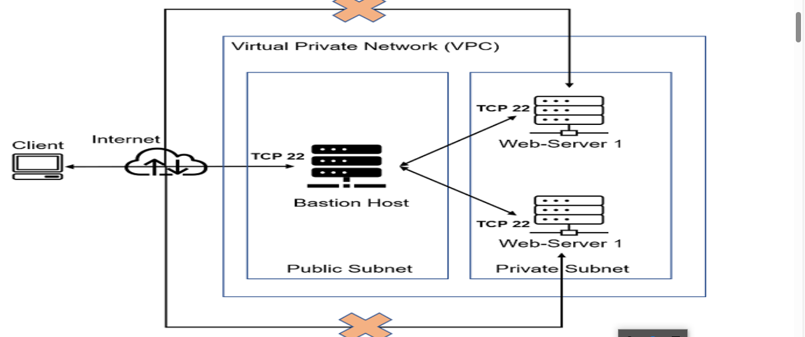
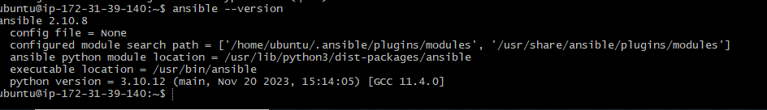

# ANSIBLE AUTOMATE PROJECT

EXPERIENCE THE POWER OF AUTHOMATION WITH ANSIBLE IN THIS HANDS ON PROJECT, SIMPLYFYING COMPLEX TASK AND STREEM LINING YOUR IT INFRASTRUCTURE.

#  ANSIBLE CONFIGURATION MANAGEMENT- AUTOMATE PROJECT 7 - 10

you have been implementing some interesting project up until now, and that is awsome.

in this project you have to perform losts of manual operation to setup vertual servers, install and configure requried software and deploy ypour web application.

this project will make you appreciate DEVOPS tools even more by making most of the routine task automated with `ansible configuration management` at the same time you will be confident in writing code using declerative languages such as `YAML `

### LET US GET STARTED.

# ANSIBLE CLIENT AS A JUNP SERVER(bastion host)

A `jump server` (sometimes refers to as bastion host) is an intermediate server through which access to access to interner network can be provided, if you think about the current architecture you were working on, idealy the web server would be inside a secured network, which cannot be reached directly from the internet. that means even DEVOPS engeneers cannot` SSH` into web server directly and can only access it through a jump server - it provides better security and reduce attack surfaces.

on the diagram below the virtual private network(VPC) is devided into two SUBNET - puplic subnet has public IP address and private subnet is only reached through private IP address.

when you get to project 15[https://dareyio-BPL-expert.readthedocs-hosted.com/en/latest/project15.html], you will see a bastion host in proper action but for now we will develop **ansible** script to stimulate the use of a jumpbox/baston host to access to our web server.

# TASK

1. install and configure ansible server client to act as a jump server/Bastion host.
2. create asinple ansible playbook to automate server configuration.

#  INSTALL AND COFIGURE ANSIBLE ON EC2 INSTANCE.

STEP 1.install and cofigure ansible on ec2 instance
1. update the name tag on your jekins ec2 instance to `jekins-ansible`. we will use this server to run playbook
2. in your github account create a new repositary and name it `ansible-fonfig-mgt`
3. install ansibl (se insatll ansible with PIP)

copy the code below: `sudo apt update`
`sudo apt install ansible`

check your ansible version by runing :`ansible --version`

4. configure jekings and build job to archive your repository content every time you change it -this will solidify your jekins configuration skills aquire in project nine (9).
. create a new freestyle project `ansible` in jekings and point it to your  `ansible-config-mht` repo
. configure va web book in github and set the web book to triger ansible build.
. configure a post-build job to save all(**) files ,like you did in project nine
5. test your set-up by making some chang in README.md file in master branch and make sure that builds starets automaticaly and jekings saves the files (build artifacts) in the following folder .

copy the code below : `ls /var/lib/jenkins/jobs/ansible/builds/<build_number>/archive/`
