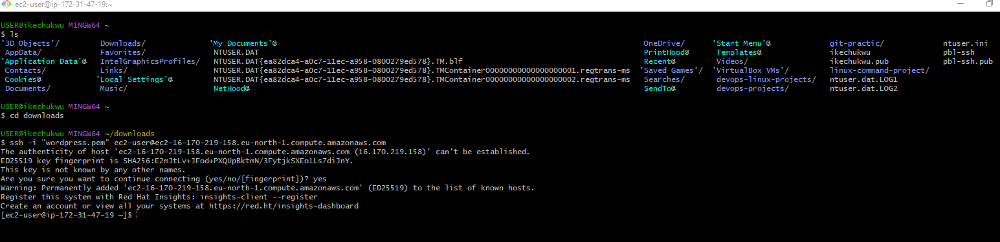

# IMPLEMENTING WORDPRESS WEBSITE WITH LVM STORAGE MANAGEMENT SYSTEM.

implementing  word press with website with with LVM storage manager on AWS EC2 Ubuntu course Discription: if you are eager to learn how to build and manage a scalable wordpress website using AWS EC2 and LVM (ogigal volume management) storage, this comprehensive course is tailored specifically for you, Gain the knowledge and skill needed to deploy and maintain a wordpress site on the AWS cloud platform, designed with beginers in mind, this course provide a step by step introduction to implementing wordpress on  AWS EC2 as the operating system.

you will learn how to set uo EC2 instance, configure security group, and establish a reliable connection to your website, through practical domonstration and hands on exercise, you will delve into the inticases of LVM storage management system on ubuntu, we will guild you through the process of creating local volume, managing disk space, and dynamically resizing volumes to accomodate changing storage requrement.  As part of the course, you will gain profficiency in installing and configuring wordpress,customizing themes,and adding essential pluggings to enhance your website functionality, we will cover performance optimization techniques and best practice for securing your wordpress installation on the AWS cloud, expert quildance will be provided into managing wordpress website on AWS EC2 with LVM storage,you will learn how to handle common challenges, troubleshoot issues and effectively manage your website issues.

By the end of this course, you will have the necessary knowledge and skill to successfuly implement and manage a wordpress website
on AWS EC2 using LVM- based storage management, whether you are web developer, system administrator,, or aspiring AWS DEVoPS professional, this course will empower you to leverage the power of AWS cloud infrastruucture, to build a scalable and reliable wordpress website.

Join us on this transformative new joiurney into the word of wordpress and AWS EC2, and unlock the potential to create and manage dynamic website website with confidence. enroll now and take first step toward mastring wordpress and AWS integratiion with LVM storage management.

# UNDERSTANDING THREE TIER ARCHITECTURE

`WEB SOLUTION WITH WORDPRESS`

you are progressing into practicing to implement web solution using different technologies, As a DEVOPS engenner , you most probably a `PHP`-based solution since, even in 2021, it is the dominant web programming language used by more website than any other programming language.

in this programme, you will be tasked to prepare storage infrastructure on two linux servers and implement a basic web solution using `wordpress` . Wordpress is a free and open source content management system written in PHP, and paired with MYSQL or MariaBD as its backend relational database mangement system(RDBMS)

this project consist of two parts:

1. configure storage subsystem for web and data base server based on linux OS, the focus of this part is to give you focus experience of working with disk,partitions and volume in Linux.

2. inatall wordpress and connect it to a remote MYSQL database server, this part of the project will solidify your skills of deploying web and DB tiers of web solution.

As a DEVOPS engeneer, your deep understanding of core component of web solution and ability to troubleshoot them will play essential role in your futher progress and development.

`THREE TIER ARCHITECTURE`

Generally, web , or mobile solution are implemented based on what is called three tier architecture.

`THREE TIER ARCHITECTURE` is a clien-server software architecture partern that comprises of three seperate layer

1. presentation layer(PL): this is the user interface, such as the client server or browser or you laptop.
2.  Business layer(BL) : this is the backend programme that implements business logic, application or web server.
3. Data Access, or Management Layer: (DAL) this is the layer for the computer data storage and data access, `data server` or filr system, such as `FTP` server, or `NFS` server

in this project; you will have the hands on experience that showcase    `three tier architecture`, while also ensuring that the disk used to store file on the Linux server are adequatly peertitioned and managed through programme such as `gdisk` and `LVM` respectively.

you will be working woith several storage and disk management concept , so to have better understanding.

NOTE: we are gradually introducing AWS solution into our element, but do not worry if you do not fully understand AWS cloud service yet, there are cloud focuses project ahead where we will get into deep detailes of various cloud concepts and technology, not only AWS, but othe cloud service provider as well.

`YOUR THREE TIER SET UP`
1. A laptop or PC to serve as a client
2. An EC2 Linux server as a web server(this is where you will install word press)
3. an EC2 linux server  as database(DB) Server.

use `RED HAT OS ` for this , by now you should know how to spin up an EC2 instance on AWS, but if you forget , refer to project one, step 0, in previous project we used ubuntu, but its better to be well versed in various Linux distribution, thus for this project, we will use very popular distribution called`RED HAT`(it also has a fully compatable derivative-CENT OS).

NOTE: for ubuntu server,when connecting to it via SSH/Putty or any other tool, we used `ubuntu` user, but for `red hat` you will need to use `ec2 user` user. connection string will look like, `ece-user@<public-ip>`.

##### LET US GET STARTED.
# IMPLEMENTING LVM  ON LINUX SERVER( web and data base server)

1. prepare a web server : lunch an EC2 instance that will serve as a web server; create three volume in the same `AZ` as you web server `EC2` each of 10 GIB. learn how to add ebs to an ec2 : 
 
2. attach all three volumes one by one to your web server EC2 instance.

3. open a linux terminal begin the configuration,`lsblk` command to inspect what block devices are attaced to the server,

 notice the name of your newly created devices, all devices in linux resides in `/dev/directory/.` inspect it with `ls/dev/`
  and make sure you see all the newley created  block devices there----, thier names will likely be `nvme0n1, nvme2n1, nvme1n1`
4. use 

5. use `df -h` command to see all mount and free spaceses on your device
6.  use `gdisk` utility to create a single petition on each of the three disk

copy the code below : `sudo gdisk /dev/nvme0n1`

Output """ GPT fdisk (gdisk) version 1.0.3

pertition table scan: MBR: not present BSD: not present: APM: not present GPT: not present

Creating new GPT entries.

Command(? for help branch-edit:p Disk/dev/xvdf:20971520 sectors, 10.0 GIB sector size(logical/phisical):512/512bytes disk identifyer(GUID):D936A35E-CE80-41A1-B87E-54D2044D160B partition table holds upto 120 entries main partition table begins at sector 2 and ends at sector 33 first usale sector is 34 , last usable sector is 2971486 partitions will be aligned on 2048-sector boundrise total free spaces is 2014 sectors(1007.0 KIB)

number starts (sector) End (sector) size code Name  12048 20971486 10.0 GIB 80E00 Linux LVM

command(? for help):w

final checks complete. About to write GPT data. `THIS WILL OVERWRITE EXSISTING PARTITIONS!!`

Do you want to procced? (y/n): yes ok; writing new GUID partition table(GPT) to /dev/nvme0n1. the operation has compleated successfuly. now your changes has been configured successfuly, exit out of the gdisk console and do the same for the remaning disk

7. use `lsblk` utility to view the newly configured partition on each of the three disk.
8. install `lvm2` package using `sudo yum istall lvm2`.

run ` sudo lvmdiskscan` command to check the available partitions

`NOTE` previously in UBUNTU we used apt commands to install packages, in REDHAT/cent OS a diffferent package manager is used, so we shall use `yum` comman insted.

9. use `pvcreate` utility to mark each of 3 disk as physical volume(PVS) to be used by LVM. copy the code :
sudo pvcreate /dev/nvme0n1
sudo pvcreate /dev/nvme2n1
sudo pvcreate /dev/nnvme1n1

10. veryfy that your phisical volume has been created successfuly run `sudo pvs`

11. use vgcreate to add all three pvs to a volume group(VG) name the VG `WEBDATA-VG`.  copy the code below :`sudo vgcreate webdata-vg /dev/nvme1n1p1 /dev/nvme2n1p1 /dev/nvme3n1p1`

12. run `sudo vgs`

13. use lvcreate to create two logical volumes `.apps-lv(use half of the pv size),and log-lv us the remaining space of the PV size.

NOTE: apps-lv will be used to store data for the website, while log-lv will be used to store data for logs. copy the code : `sudo lvcreate -n apps-lv -L 14G webdata-vg`
`sudo lvcreate -n logs-lv -L 14G webdata-vg`
14. verify that your local volume has been created by running `sudo lsvs`

15. verify the entire setup : `sudo vgdisplay -v #view complete setup - VG, PV, and LV`
`sudo lsblk `

16. use `mkfs.ext4` to format=rt the logical volume with  `ext4 filesystem`

copy the code: `sudo mkfs -t ext4 /dev/webdata-vg/apps-lv`
`sudo mkfs -t ext4 /dev/webdata-vg/logs-lv`

17. create `/var/www/html` directory to store wbsite file
18. create `/home/recovery/logs` to store backup of log data
19. mount `/var/www/html` on `apps-lv` logical volume

copy the code below : `sudo mount /dev/webdata-vg/apps-lv /var/www/html/`
20. use `rsync` utility to back up the files in the log directory`/var/log` into `/home/recovery/logs/`(this is requred before mounting the file system)

copy the code : `sudo rsync -av /var/log/. /home/recovery/logs/`

21. mount `/var/log on log-iv` iogical volume. `NOTE( that all the existing data on /var/log will be deleted, this is why step 20 above is very importasnt)`

copy the code below : `sudo mount /dev/webdata-vg/logs-lv /var/log`

22. restor log files back into`/var/log` directory. copy the code : `sudo rsync -av /home/recovery/logs/log/. /var/log`

23. update `/etc/fstab` so that the mount configuration will persist after restart of the server.

the UUID of the device  will be used to update the `/etc/fstab` file .

run : `sudo blkid`

 
sudo vi /etc/fstab

update `/etc/fstab` in the formart using your own UUID and remember to remove the leading and ending quote.

24. test the configuration and reload the daemon, copy the code :`sudo mount -a`
`sudo systemctl daemon-reload`
25. verify your setup by runing : `df -h`

# INSTALLING WORDPRESS AND CONFIGURING TO USE MYSQL DATABASE

# STEP 2.
prepare the database server

lunch a second RedHat EC2 instance that will have a role-`DB server`  repeat the same step as for the web server, but instead of `apps-lv` create `dl-lv` and mount it to  `/db` directory instead of `/var/www/httml/

# STEP 3. 
install wordpress on your webserver  EC2
1. update repository
`sudo yum -y update`

2. install wget,Apache and its dependencies

`sudo yum -y install wget httpd php php-mysqlnd php-fpm php-json`

3. start apache. copy the code below: 
`sudo systemctl enable httpd`
`sudo systemctl start httpd`

4. intall php and its dependenses.

copy the code:sudo yum install https://dl.fedoraproject.org/pub/epel/epel-release-latest-8.noarch.rpm
sudo yum install yum-utils http://rpms.remirepo.net/enterprise/remi-release-8.rpm
sudo yum module list php
sudo yum module reset php
sudo yum module enable php:remi-7.4
sudo yum install php php-opcache php-gd php-curl php-mysqlnd
sudo systemctl start php-fpm
sudo systemctl enable php-fpm
setsebool -P httpd_execmem 1

5. restart apache

`sudo systemctl restart httpd`

6. download wordpress and copy wordpress to `var/www/html`

copy the code:
mkdir wordpress
cd   wordpress
sudo wget http://wordpress.org/latest.tar.gz
sudo tar xzvf latest.tar.gz
sudo rm -rf latest.tar.gz
cp wordpress/wp-config-sample.php wordpress/wp-config.php
cp -R wordpress /var/www/html/

7. configure SELinux policies

copy the code :
 sudo chown -R apache:apache /var/www/html/wordpress
 sudo chcon -t httpd_sys_rw_content_t /var/www/html/wordpress -R
 sudo setsebool -P httpd_can_network_connect=1
# STEP FOUR(4)
1.  `install MYSQL on your DB sever EC2`

copy the code :
sudo yum update
sudo yum install mysql-server

# STEP FIVE(5). configure BD to work with wordpress

copy the code :sudo mysql
CREATE DATABASE wordpress;
CREATE USER `myuser`@`<Web-Server-Private-IP-Address>` IDENTIFIED BY 'mypass';
GRANT ALL ON wordpress.* TO 'myuser'@'<Web-Server-Private-IP-Address>';
FLUSH PRIVILEGES;
SHOW DATABASES;
exit

# STEP SIX(6)
configure wordpress to connect to remote data base.

`HINT` donot forget to open MYSQL port 3306 on BD server EC2. for extra xtra security, you shall allow access to BD server only from your web server ip address, in inbound rule configure specify source as /32

1. install mysql client and test that you can connect from your web server to your DB serving by using `mysql-client`

copy the code: 
sudo yum install mysql
sudo mysql -u admin -p -h <DB-Server-Private-IP-address>

2. verify if you can successfyly `SHOW DATABASE` command and see a list of existing database.
3. change permission and configuration so apache could use wordpress.
4. enable TCP port 80 in inbound rules configuration for your web server EC2(enable from anywhere 0.0.0.0/0 or from your workspace ip)
5. try to acces from your browser the link to your wordpress :`http://<web server ip address>/wordpress/`
