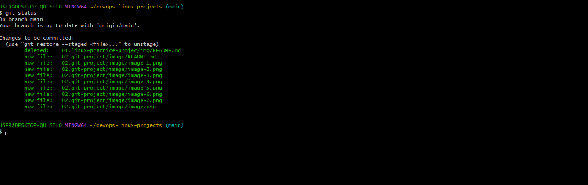

# the git project
`these project are collection of friendly task designed to introduce people to the foundamentals of git` a powerful `version control system` used in software development, this project introduces the core concept of git.
we shall learn how to`efficiently initialize a repository and make commits work with branches colaboration and remote repository, and tagging track changes.`

# initializing arepository and making commits
`git is a distributed version control system` this is the typical definition you will find on the internet, git essentially solve problem of sharing source code efficiently and keeping track of changes made to source code.

before initializing a git repo, you must have installed git.

# initializing a Git repository
`1. open terminal on your computer, eh Git Bash`
`2. on your terminal create your working folder or directory, eg devops folder using this command [mkdir devops]` `3. change or move into your working directory or folder using this command [cd devops]` `4. while you are inside the folder run the [git init] command

# making first commits

in our last section we successfully created our working directory and initailized it in Git repository, now we will make our first commit.
before that, lets understand `git commit` `commit is more like saving the changes you made to your file, it could be adding, modifying or deleting file or text`

when you make your commit, git takes a snapshort of the current state of your repository and save a copy of it in the git folder inside your working directory.

now lets make our first commit by following these steps
`1. inside your working directory create a file index.txt using this command [touch index.txt] write any sentence of your choice inside the text file . afterward save your changes 2. add your changes to git stagging area using this command[git add .], 3. to commit your changes to git, run this command [git commit -m "initial commit"]`..

# working with branches

imagine you have a notebook and you want to write different story on different pages of your notebook, so that you do not mess up your previous note.

git branch helps you create a defferent copy(page) of your source code, in your new branch you can make changes as you wish, your chanches is independent on what is availaible on the main copy

git branch is commonly used to develop new features of your application. you will agree that initail code cant be added to the code base of your live application.

git branch is also a tool for collaboration within remote teams`developers working from different location`, they can make branches while working on the same feature, and at the end of the day converge thier code to one branch.

##  follow the steps to create a new branch
`to create a new branch enter this command;{git checkout -b}`

`the -b flag helps you creat and change into a new branch.`
Having made an initial commit, now lets create a breacnch

## listing your git branches
`use the command bellow to list your git branches on your local git repository`
`git branch`

## changing into an old branch
`git checkout <branch-name>`

## merging a branch into another branch
lets say we have two branches `A` and `B` and we want to add the content of branch `B` into `A`,
 firstly we change into branch `A`, and run the following command
 `git merge B`

 # deleting a git branch
 when new features is added to an application, its often done in a feature branch, usually this feature branch is deleted when the code must have tested and merged into a staging or DEV enviroment depending on the branch strategy of the team

 git branch can be deleted with the command below
 `git branch -d <branch_name>`

 # COLLABORATION AND REMOTE REPOSITORY
 
 Lets take a moment to recap what we have learnt; we learn git is `distributed version control system that essentially solves the problem sharing source code and tracking changes made to source code`, ew also learned about some opiorations like `initializing git repository in our nlocal machine, creating commits, branches etc`

 note that git is also used for collaboration among remote team`developers living in different location`, but thinking of it how can developers working remotely colaborate`(making changes and updating)`on the same code base since we curently have our code in our local computer

 this is where `github` comes in; github is a `a web based platform where git repository is hosted` by hosting our git repository on github , it is now made available to the public for consumption, now `remote team can now make chanches, update and add file to the same repository`

 # creating `github account`

 1. head to github.com
 2. enter username, password and email address
 3. click on the verify botten to verify your account
 4. click on create to create your account
 5. an activation code will be sent to yoyur mail, copy the code and fill it on the text boxes , then click continue
 6. select your preference and click continue
 

 # creating repository
 1. click on the plus sign`+` at the top right conner of your git hub accunt, a drop down will appear, select `new repository`
 

 2. fill out the form by adding unique repository name,discription and ticking the boxex to add `README.md file`

 # pushing your local `git repository` to your remote `github repository.`

 In previous lesson, we have written our story in our local git repository, our friend is interested in contributing to our story, but ther are unable to do so because we have our story locally in our machine

 Having created a `github account and git repository`in our earlier step, lets send a copy of our story to `github account`

 we well achieve this by followiing the steps bellow
 `git remote add origing <link to your git hub repo>`
 
 

 ` my response is this way because i have alredy linked this repo , reason being that i am currently working a series of devops projects so i decided to have one github repository for all devops related project . in this case i have to add the changes i have made first by first commiting it through the following teps`
 1. git status
 2. git add .
 3. git commit -m " git project"
 4. git push

# git status
`git status`

# git add
`git add .`

# git commit
`git commit -m"relevant text"`

# git push
` git push`

