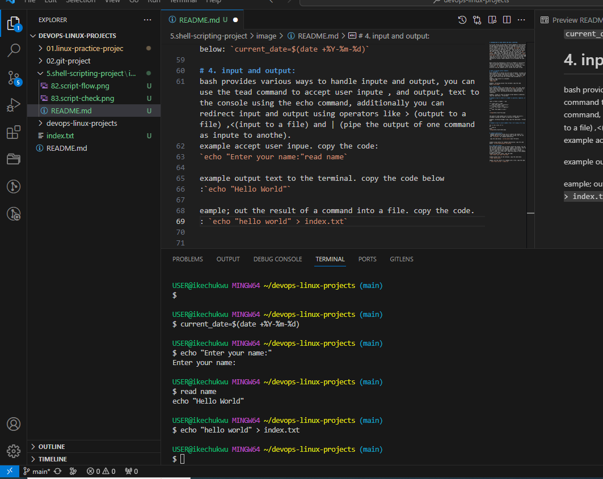
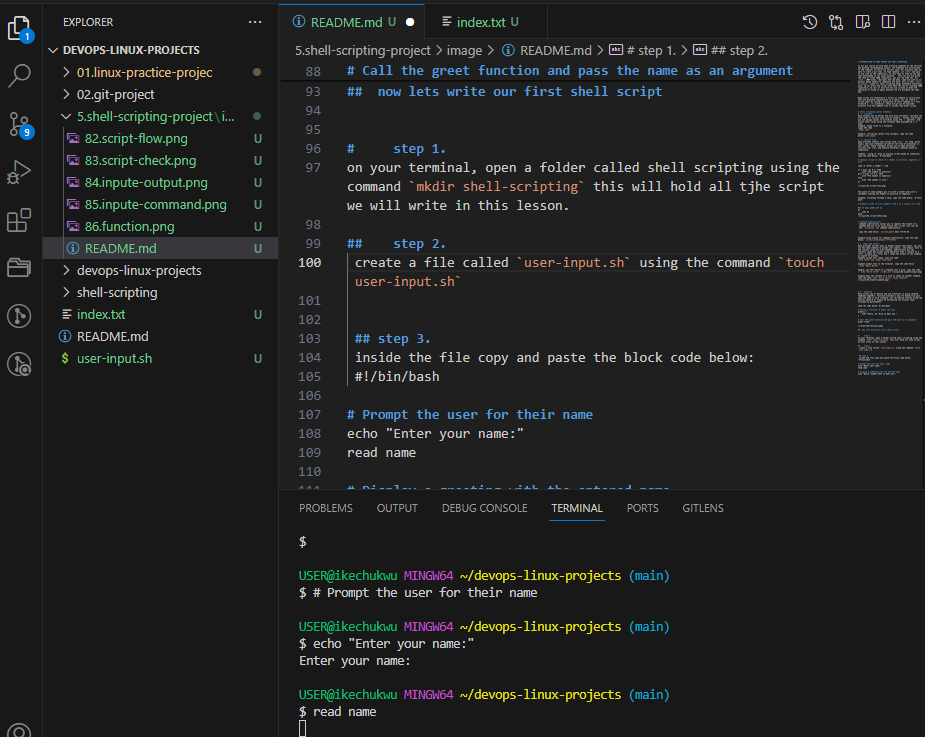

# INTRODUCTION TO USER INPUTE AND SHELL SCRIPTING.

In our git course we have been writting commands on the terninal and getting corresponding output, the commands are instruction to the computer to carry out certain task, for instance when we want to clone a git repo, we type command `git clone` and pass in the link to the repository, in less than no time we see the repo downloaded in our local machine.   lets say you are given the task to clone 1000 repository, yes you can type the `git clone ` 1000 times. that gets the job done, some one with no so patient maybe unable to compleate the task, this is wher `shell scripting ` comes in, shell scripting helps authomate repetitive task, we can write the script that does the job of clonning 1000 repository, we call it once and the job is done.we have the opotunity of using it again whenever we are assigned the same job.

Bash script are essentially a series of command or instruction that are executed sequentially in a shell, you can create a script shell by saving a collection of shell command in a text filewith a `.sh` extension. these script can be executed directly from the command line or called from other script.

# shell scripting syntax elements.
#  1. variable: 
bash allowos you to define and work with variables. variable can store data of various type such as nunbers , strigs, and arrays, you can assign values to varisbles using the `=` operator, and access their value using the variable name preceded by a `$` sign. 
example: asign value to a vatiable:
coppy the code
`name= jhon`

Example: retrieving values from variable: copy the code  below:`echo $name`

#  2. control flow: 
bash provides control flow system like`-else`, for loop, while loops, and case statement to control the flow of execution in your script. these statement allows you to make decisions,itirates over list, and execute different commands based on conditions.

example : using if -else to execute script based on condition;
copy the code below: `#!/bin/bash

# Example script to check if a number is positive, negative, or zero

read -p "Enter a number: " num

if [ $num -gt 0 ]; then
    echo "The number is positive."
elif [ $num -lt 0 ]; then
    echo "The number is negative."
else
    echo "The number is zero."
fi`

the piece of code prompts you to write a nunber and print a ststement stating the number is positive or nagative.

example: itirating through a loop. copy the code below: `#!/bin/bash

# Example script to print numbers from 1 to 5 using a for loop

for (( i=1; i<=5; i++ ))
do
    echo $i
done`

# command substitution:
 command substitution allows you to capture the output of a command and use it as value within your script, you can use the  `$()syntax` for command substitution.

 copy the code below: `current_date=`date +%Y-%m-%d

example using syntax for command substitution: copy the code below: `current_date=$(date +%Y-%m-%d)`

# 4. input and output:
bash provides various ways to handle inpute and output, you can use the tead command to accept user inpute , and output, text to the console using the echo command, additionally you can redirect input and output using operators like > (output to a file) ,<(input to a file) and | (pipe the output of one command as inpute to anothe).
example accept user inpue. copy the code:
`echo "Enter your name:"read name`

example output text to the terminal. copy the code below
:`echo "Hello World"`

eample; out the result of a command into a file. copy the code.
: `echo "hello world" > index.txt`

example pass the content of a file as input to another command. copy the code:`echo "hello world" | grep "pattern"`

# 5   function
bash allows you to define and use functions to group related commands together. function provides a way tro modularise your code and make it more reusable. you can define funtion using the funtion keyword or symply by declearing the funtion name, followed by parentheses.

copy the code below: #!/bin/bash

# Define a function to greet the user
greet() {
    echo "Hello, $1! Nice to meet you."
}

# Call the greet function and pass the name as an argument
greet "John"

##  now lets write our first shell script

#     step 1. 
on your terminal, open a folder called shell scripting using the command `mkdir shell-scripting` this will hold all tjhe script we will write in this lesson.

##    step 2.
 create a file called `user-input.sh` using the command `touch user-input.sh`

 ## step 3.
 inside the file copy and paste the block code below:
 #!/bin/bash

# Prompt the user for their name
echo "Enter your name:"
read name

# Display a greeting with the entered name
echo "Hello, $name! Nice to meet you."

a little bit about the code block. the script promt for your name, when you type your name, it displays the text hello! nice to meet you. also`!/bin/bash` helps you specify the type of bash interpreter to be used to execute the script.

## 4 save your file.

## 5
run the command `sudo chmod+x user-input.sh` this makes the file executable.

## 6 
run the script using the command:` ./user-input.sh`

## additional resources.

if you like text based learning material, this guide will be of help `learn-shell-scripting`. visit the link to learn shell scripting in an interactive enviroment for free.

# DIRECTORY MANIPULATION AND NAVIGATION.

On the back of your lesson on directory manipulation and navigation of linux file system, we will be writing a simple shell scripot as a way of practicing what we learnt.  
 this script will display the current directory, create a new directory called `my-directory` change that to directory, create two file inside it, list the file, move back one level up, remove the `my-directory` and its contents, and finally list the file in the current directory again.

 procceed by following the step below:

 1. open a file named `navigating-linux-filesystem.sh`
 2. paste the code block below in your file: #!/bin/bash

# Display current directory
echo "Current directory: $PWD"

# Create a new directory
echo "Creating a new directory..."
mkdir my_directory
echo "New directory created."

# Change to the new directory
echo "Changing to the new directory..."
cd my_directory
echo "Current directory: $PWD"

# Create some files
echo "Creating files..."
touch file1.txt
touch file2.txt
echo "Files created."

# List the files in the current directory
echo "Files in the current directory:"
ls

# Move one level up
echo "Moving one level up..."
cd ..
echo "Current directory: $PWD"

# Remove the new directory and its contents
echo "Removing the new directory..."
rm -rf my_directory
echo "Directory removed."

# List the files in the current directory again
echo "Files in the current directory:"
ls

# 3
run the command :` sudo chmod +x navigating-linux-filesystem.sh` to execute permission on the file.

# 4
run your scriot using this command :` ./navigating-linux-filesystem.sh`

# FILE OPERATION AND SORTING

In this lesson we will be writing simple shell script that focuses on file opoeration and sorting.

this script creates three files (file.1, txt. file 2, txt and file 3, txt), display the file in their current other, sorth them alphabeticaly, save the sorted file.txt, dis play the sorted files, rename the sorted file to sorted_file_sorted_alphabetically.txt, and finally display the content of the final sorted file. lets procceed using the step below:
# step 1.
open your terminal and create a file called `sorting.sh` using the command `touch`
# sterpo 2.
copy and paste the code below the block into the file. :

#!/bin/bash

# Create three files
echo "Creating files..."
echo "This is file3." > file3.txt
echo "This is file1." > file1.txt
echo "This is file2." > file2.txt
echo "Files created."

# Display the files in their current order
echo "Files in their current order:"
ls

# Sort the files alphabetically
echo "Sorting files alphabetically..."
ls | sort > sorted_files.txt
echo "Files sorted."

# Display the sorted files
echo "Sorted files:"
cat sorted_files.txt

# Remove the original files
echo "Removing original files..."
rm file1.txt file2.txt file3.txt
echo "Original files removed."

# Rename the sorted file to a more descriptive name
echo "Renaming sorted file..."
mv sorted_files.txt sorted_files_sorted_alphabetically.txt
echo "File renamed."

# Display the final sorted file
echo "Final sorted file:"
cat sorted_files_sorted_alphabetically.txt

# step 3.
set execute permission on sorting.sh using this command `sudo chmod +x sorting.sh`

# step 4
run your script using this command : `./sorting.sh`

# WORKING WITH NUMBERS AND CALCULATIONS.

the script define two variables num 1 and num 2 with numeric values, performes basic arithmetic calculations(addition,subsraction,multiplication and moudles) and display the result, it also performs more complex calculations such as raising num 1 to the power of 2, and calculating the square root of number 2, and display the result as well. lets procceed by following the steps below.

# step 1
on your terminal create a file called `calculations.sh`
# step 2
copy and paste the block code below: #!/bin/bash

# Define two variables with numeric values
num1=10
num2=5

# Perform basic arithmetic operations
sum=$((num1 + num2))
difference=$((num1 - num2))
product=$((num1 * num2))
quotient=$((num1 / num2))
remainder=$((num1 % num2))

# Display the results
echo "Number 1: $num1"
echo "Number 2: $num2"
echo "Sum: $sum"
echo "Difference: $difference"
echo "Product: $product"
echo "Quotient: $quotient"
echo "Remainder: $remainder"

# Perform some more complex calculations
power_of_2=$((num1 ** 2))
square_root=$(echo "sqrt($num2)" | bc)

# Display the results
echo "Number 1 raised to the power of 2: $power_of_2"
echo "Square root of number 2: $square_root"

# 3.
execute permission by` sudo chmod +x calculations.sh`
# step 4.
run your script using the command : `./calculations.sh`

# FILE BACKUP AND TIMESTAMPING.

As a `DEVOPS` engeneer backing up data base and other storage devices is one of the most common task you get to carry out.

this script define the source directory and backup directory paths, its then create a timestamp using the current date and time, and create a backup directory with the timestamp appended to its name. the scripts then copis all files from to source directory to the backup using the `cp` command with `-r` for recoursive copying. finally it display a message indecating the completion of the backup process and show the path of the backup directory with the timestamp.

lets procceed using the step below:

# step 1
on your terninal open a file `backup.sh` using the `touch command`
# step 2
copy and paste the block code below into the file: #!/bin/bash

# Define the source directory and backup directory
source_dir="/path/to/source_directory"
backup_dir="/path/to/backup_directory"

# Create a timestamp with the current date and time
timestamp=$(date +"%Y%m%d%H%M%S")

# Create a backup directory with the timestamp
backup_dir_with_timestamp="$backup_dir/backup_$timestamp"

# Create the backup directory
mkdir -p "$backup_dir_with_timestamp"

# Copy all files from the source directory to the backup directory
cp -r "$source_dir"/* "$backup_dir_with_timestamp"

# Display a message indicating the backup process is complete
echo "Backup completed. Files copied to: $backup_dir_with_timestamp"

# step 3.

execute permission on backup.sh using the command :`sudo chmod +x backup.sh`

# step 4.

run your script using the command. : `/.backup.sh`

